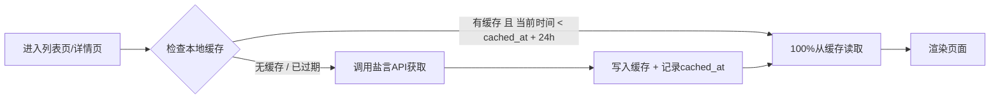
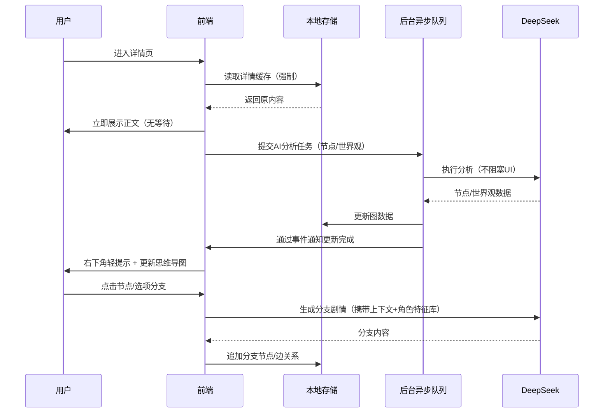

# 互动式小说产品需求交互设计文档（PRD）- V1.1

**文档版本：** V1.1  
**文档日期：** 2026年5月12日  
**修订说明：**  
- 优化正文加载体验：进入正文时所有AI分析（节点、世界观）后台静默执行，不打断用户阅读  
- 强化知乎接口缓存策略：强制本地缓存24小时，期限内仅从缓存读取，不调用远程API  

---

## 一、项目概述

### 1.1 项目背景与定位

基于已有的知乎盐言故事开放内容库，通过AI互动叙事技术，将传统的线性短篇阅读升级为“可选择剧情的互动式小说”沉浸式阅读体验。核心目标是解决当前网文阅读的“被动接收、无法参与”的痛点，推动短篇故事从静态文本向动态可交互内容形态进化，与盐言故事推出的“短篇故事3A计划”（AI、泛人群、全媒介）形成战略契合。

### 1.2 产品价值主张

- **为读者：** 每一次阅读都独一无二。通过剧情选择与AI驱动的动态扩展，让读者从被动阅读者转变为故事的参与者甚至共同创作者。
- **为内容方：** 突破传统网文框架，通过AI技术拓展故事的交互可能性和多结局属性，有效延长单篇内容的阅读时长与用户粘性。

### 1.3 核心特征

- 以“盐言故事”短篇内容库为基础，风格本身具有“短篇幅、快节奏、强情感”的特点
- 强调AI实时生成剧情分支与世界观拓展
- 可视化思维导图导航，让故事结构一目了然
- 刘看山IP形象融入引导体验

### 1.4 用户画像

- **核心用户：** 18-35岁，对言情、悬疑、现实题材感兴趣的知乎盐选会员用户，对强情绪代入与多结局探索有明确偏好
- **重要用户：** 网文重度读者，乐于探索互动叙事、游戏化阅读形式的年轻人
- **机会用户：** 创作者、内容编辑等，希望借鉴或拓展作品的多维叙事可能性

---

## 二、技术架构

### 2.1 整体架构

```
┌─────────────────────────────────────────────────────────────┐
│                        前端应用层                            │
│  ┌──────────┐  ┌──────────┐  ┌──────────┐  ┌──────────┐   │
│  │  列表页  │  │  详情页  │  │ 思维导图 │  │  引导组件  │   │
│  └────┬─────┘  └────┬─────┘  └────┬─────┘  └────┬─────┘   │
├─────────┴───────────┴───────────┴───────────┴─────────────┤
│                        业务逻辑层                           │
│  ┌──────────────────────────────────────────────────────┐ │
│  │  后台静默分析引擎 │ 节点生成器  │ 分支管理器  │ 选择器  │ │
│  └──────────────────────────────────────────────────────┘ │
├───────────────────────────────────────────────────────────┤
│                        数据存储层                           │
│  ┌──────────────────────────────────────────────────────┐ │
│  │  本地缓存（强制24h）  │  图数据  │  会话状态  │  版本   │ │
│  └──────────────────────────────────────────────────────┘ │
├───────────────────────────────────────────────────────────┤
│                        外部服务层                           │
│  ┌──────────┐  ┌──────────┐  ┌──────────┐  ┌──────────┐   │
│  │ 盐言API  │  │  DeepSeek│  │  豆包AI  │  │  其他  │   │
│  │ (缓存优先)│  │   (主)   │  │  (备)   │  │          │   │
│  └──────────┘  └──────────┘  └──────────┘  └──────────┘   │
└─────────────────────────────────────────────────────────────┘
```

### 2.2 AI大模型选型

| 对比维度 | DeepSeek（推荐主用） | 豆包AI（备用降级） |
|---------|---------------------|-------------------|
| **成本** | Flash：输入0.02元/百万Tokens；输出2元/百万Tokens；Pro（限时）：输入0.025元/百万Tokens | Seed 2.0 lite：输入0.6元/百万Tokens；输出3.6元/百万Tokens |
| **优势场景** | 代码生成、长文本推理、结构化输出、性价比突出 | 多轮对话管理、医疗领域、垂直子模型能力强 |
| **适配性** | 支持国产算力适配，开启推理时延约10-20ms | 响应延迟<500ms，工程化工具链成熟 |

**选型结论：** 优先使用 **DeepSeek** 作为剧情生成、分支预测、节点提炼的主模型。其成本约为豆包的1/30-1/10，尤其适合本项目高频多Token调用的场景。若DeepSeek限流或配额不足，自动降级切换至豆包API保持服务连续性。

> **安全边界说明**：由于AI拟人化互动具有潜在的成瘾性和情感依赖风险，建议建立心理健康保护机制，在检测到用户出现极端情绪或长时间沉迷行为时及时中断和引导。

---

## 三、核心功能模块

### 3.1 列表页

#### 3.1.1 页面布局

| 区域 | 宽度/占比 | 内容 |
|------|-----------|------|
| 顶部导航栏 | 100% | Logo + “知乎·盐言·互动阅读” + 个人入口 |
| 搜索栏 | 100% | 搜索输入框 + 搜索按钮 |
| 故事列表 | 100% | 卡片式列表滚动展示 |
| 刘看山形象 | 右下角悬浮 | 引导提示气泡 |

#### 3.1.2 功能规格

**故事列表展示：**
- 从API获取盐选故事概要列表（work_id、title、artwork、tab_artwork、description、labels）
- 列表顺序与内容库固定表顺序一致
- 每个故事卡片包含：封面图、标题、简介、标签（以Tag组展示）
- 点击卡片跳转至详情页

**搜索功能：**
- 输入框支持模糊匹配（按标题或简介）
- 搜索结果实时筛选展示
- 无结果时展示空状态提示

**🔄 缓存策略（强制本地一天）：**
- 用户首次进入列表页时，调用盐言API获取列表，将数据存入本地存储（IndexedDB/LocalStorage），并记录时间戳 `cached_at`
- 在接下来的24小时内，任何刷新或重新进入列表页的操作，**只从本地缓存读取数据，不再发起任何网络请求**。
- 缓存键名：`yyan_story_list_v1`，结构：
  ```json
  {
    "data": [...],
    "cached_at": 1673456789000,
    "expires_at": 1673543189000
  }
  ```
- 超过24小时后，自动清除缓存，下次进入列表页时重新请求API并刷新缓存。
- **强制规则**：即使API可用，也绝不绕开缓存进行实时调用；只有在缓存不存在或已过期时才会发起网络请求。
- 降级方案：若缓存存在但数据解析失败，提示用户“缓存数据受损，即将重新获取”，然后执行刷新流程。

#### 3.1.3 页面动效

- 卡片加载时淡入动画
- 搜索时防抖300ms
- 下拉刷新和上拉加载更多
- 刘看山形象在用户停留超10秒时弹出引导气泡：“选一本你喜欢的盐选故事开始互动吧~”

---

### 3.2 详情页

#### 3.2.1 页面布局（三栏式结构）

```
┌─────────────────────────────────────────────────────────────────┐
│                           顶部导航栏                             │
├─────────────────────────────────────────────────────────────────┤
│  ┌──────────────────────────┬─────────────────────┬───────────┐│
│  │      AI思考：有你就够    │   正文内容区域       │  思维导图  ││
│  │      < 正文内容展示>       │                     │   区域    ││
│  │                          │                     │ (右上角)  ││
│  │                          │                     ├───────────┤│
│  │                          │                     │ 选择面板  ││
│  │                          │                     │ (右下侧)  ││
│  ├──────────────────────────┴─────────────────────┴───────────┤│
│  │                        底部操作栏                             ││
│  │            [番外]  [续写]  [分支记录]  [分享]                  ││
│  └─────────────────────────────────────────────────────────────┘│
│                                                                    │
│  注：右上角思维导图可全屏展开                                           │
└─────────────────────────────────────────────────────────────────┘
```

**各区域详细规格：**

| 区域 | 占比 | 核心功能 |
|------|------|----------|
| 左侧正文 | 50% | 盐选故事正文展示 + 关键节点高亮 + 分支交互 |
| 右上思维导图 | 25% | 总览故事结构、节点导航、全屏模式 |
| 右侧选择面板 | 嵌入右区 | 展示用户选择历史 + AI生成内容卡片列表 |

#### 3.2.2 正文区域功能

**1. 正文展示：**
- 调用API获取故事详情（work_id、chapter_name、author_avatar、author_name、labels、introduction、content）  
  → 详情API同样遵循 **强制本地缓存24小时** 规则（参见4.1节）。
- content字段按段落解析展示
- 段落间距有利于阅读（line-height 1.6-1.8）
- Markdown格式支持换行和加粗

**2. 关键节点后台生成（不打断阅读）—— 核心修改**

| 阶段 | 触发时机 | 展示样式 | 后台行为 |
|------|----------|----------|----------|
| 进入正文页 | 页面加载完成，正文已展示 | **不弹出模态框/不阻塞**，仅在页面右下角（刘看山附近）显示一个轻量化Loading提示：“AI正在分析故事节点中⋯” ，提示条可自动淡出或用户点击关闭 | 调用DeepSeek分析全文，生成节点列表（位置、标签类型、分支预设） |
| 生成完成 | 分析完毕 | 右下角刘看山出现气泡：“关键节点已就绪，点击思维导图查看”，用户可忽略；思维导图自动更新节点；正文中的关键词句逐步高亮（无动画闪烁） | 将节点数据存入本地图数据库，更新思维导图渲染 |
| 世界观/关系网生成 | 后台并行执行 | 无任何干扰性提示，仅在思维导图右侧的“世界观”折叠面板中展示生成进度条（若用户主动打开） | 生成宏观世界观、人物小传、关系网，存入图数据 |

**设计原则：**  
- 用户进入详情页的第一优先级是 **立即阅读原文**，无需等待AI。  
- 所有AI分析任务放入后台队列，使用 `requestIdleCallback` 或 Web Worker 异步执行。  
- 若用户产生分支交互（点击高亮节点）时，对应节点的AI预设分支选项必须已就绪，否则展示占位提示“分析中，请稍后点击”。

**节点识别规则：**
- AI调用DeepSeek分析正文全文，从以下维度识别节点：**标签维度、情节转折点、人物关键对话/行动、情绪峰值点、信息爆点** 
- 每个节点的位置通过段落索引锁定
- 节点级别：主节点（橙红色高亮）、子节点（浅蓝色高亮）、分支点（紫色高亮 + 分支图标）

**3. 分支交互：**
- 点击高亮节点，弹出分支选择弹窗
- 弹窗内提供：AI预设的3个分支选项 + 手动输入自定义选项的文本框
- 用户选择一个选项后：
  - 在右侧思维导图下方（选择面板）展示用户选择的内容卡片
  - AI以Loading动画开始生成分支剧情
  - 生成完成后输出文本，展示在同一个区域作为新的卡片条目
  - 若存在多个选择的记录，则按时间倒序列表展示
  - **同时**思维导图在该节点下衍生出对应当前分支的孩子节点（子剧情走向）
  - 正文区域可实时滚动至生成的剧情段落
  - 任何分支生成的内容同时追加到当前节点下方的正文末尾

**4. 选择面板设计：**
- 展示顺序：时间倒序（最新的在最上方）
- 每个条目包含：
  - 用户选择文本（加粗前缀“你的选择：”）
  - AI生成的剧情内容（普通字体）
  - 生成时间戳
- 条目右上角提供编辑/删除/重新生成功能
- 提供折叠/展开，避免过多条目造成视觉负担
- 最多保留最近30条交互记录

#### 3.2.3 思维导图功能

**核心定位：** 总览故事结构、快捷定位章节/分支、切换不同的故事走向。

**UI结构：**
- 常规模式：右上角紧凑显示树形结构根节点（视野受限）
- 全屏模式：点击全屏按钮后思维导图全屏展开，正文区收起，左下角提供右下浮动返回按钮
- **新增世界观折叠面板**：在思维导图右侧（或底部）提供一个可展开的“世界观·人物志”区域，展示AI后台生成的背景设定和关系网，不影响主阅读流。

**节点类型：**

| 类型 | 定义 | 视觉符号 |
|------|------|----------|
| 根节点 | 故事名称 | 金色边框 + 图标 |
| 主节点 | 章节或大剧情转折 | 蓝色边框 + 章节编号 |
| 子节点 | 剧情迷你分支 | 绿色边框 |
| 分支点 | 用户选择分支的关键节点 | 紫色边框 + 分支图标 |
| AI衍生节点 | 番外/续写创建的节点 | 橙色虚线边框 + “AI”标记 |
| 结局节点 | 故事的结局内容 | 红色边框 + “End”标记 |

**交互操作：**

| 操作 | 行为 |
|------|------|
| 点击节点 | 全局定位到正文对应的内容位置，自动滚动到该段落 |
| 双击节点 | 在全屏思维导图中展示该节点的详细剧情简介卡片 |
| 右键节点 | 打开快捷菜单（“定位到该情节”“查看衍生分支”“编辑该情节”等选项） |
| 拖动节点 | 调整为自定义布局（仅全屏模式下支持） |
| 节点搜索 | 顶部搜索框中输入关键词，匹配节点并高亮 |
| 全屏模式收起 | 点击左下角浮窗或右上角「收起到右上角」按钮，返回常规页布局 |
| 分支切换 | 右击分支节点，切换思维导图和正文展示为该分支的对应剧情走向，形成版本切换 |

**状态存储：**
- 思维导图的布局和节点展开/收起状态自动保存在LocalStorage
- 用户关闭浏览器后再打开，恢复到上次的视图状态

#### 3.2.4 AI番外/续写功能

**触发：** 正文末尾展示两个按钮：【番外】、【续写】

**番外功能：**
- 点击后调用DeepSeek接口
- 基于当前故事的世界观、人物设定和全部上下文
- 生成3个AI预设的番外方向（如“高中时期的开端”“番一转世版”“新角色介入”）
- 用户选择预设方向或自定义输入具体内容
- 生成的番外内容追加到思维导图的“番外”主节点下，并以橙色虚线边框展示
- 正文末尾自动展开番外文本，与正文有明显的分隔线标注“番外区域·番外篇”

**续写功能：**
- 类似番外逻辑，但续写是基于当前正在阅读的位置（最后一个节点/最后一个分支点/最后一个番外内容）
- 生成3个AI预设的后续走向选项
- 生成的内容在当前节点后追加新的子剧情节点
- 思维导图中更新节点的续写父子关系

**提示词工程保障：**
- 系统需要在提示词中注入全局角色特征库（人物性格、语言风格、关系网），确保番外/续写的内容符合角色一致性
- 用few-shot注入典型场景样例

#### 3.2.5 世界观生成与关系网（后台静默执行）

| 阶段 | 动作 | 用途 |
|------|------|------|
| 进入正文 | 后台调用AI根据全文自动生成宏观世界观（整体风格、时代背景、基本矛盾） | 后续新增分支或番外延续时保持一致基调 |
| 逐章节 | AI提取人物角色（每个人物或NPC都有自己的小传）+ 人物关系网 + 时空节点 | 思维导图中可选展示“人物关系”网状图 |
| 用户深钻 | 当用户深度钻取某角色时，生成更多小传 + 背景故事 |

该数据存储于Graph模式的数据库结构，以节点‑边模型存储：节点包含角色/地点/物品元数据，连边标注关系

---

## 四、数据流转设计

### 4.1 故事数据的获取与缓存 —— 强制24小时本地缓存

**核心规则：**  
> 任何对知乎盐言API的调用（列表、详情）都会将结果缓存到本地，缓存有效期 **严格24小时**。在有效期内，应用 **绝不发起新的网络请求**，所有数据读取均来自本地缓存。只有缓存不存在或已过期时，才允许调用API并刷新缓存。



**缓存结构详情：**

| 数据类型 | 缓存键名 | 内容 | 有效期策略 |
|---------|---------|------|-----------|
| 故事列表 | `yyan_story_list_v1` | API返回的data数组 + `cached_at` + `expires_at` | 24h，过期后清除项 |
| 故事详情 | `yyan_story_detail_{work_id}` | API返回的data对象（章节内容、导语等）+ 时间戳 | 24h，独立过期 |

**强制缓存的行为保障：**
- 用户手动下拉刷新列表页时，**不会**触发API请求，仍然展示缓存内容（除非弹出提示“缓存将在X小时后更新”并提供“立即更新”按钮）。
- 如果用户点击“立即更新”按钮，则强制跳过缓存发起一次新的API调用，刷新缓存并重置24小时倒计时。
- 设计一个“数据来源”指示器：在列表页底部或详情页右上角展示一个灰色圆点及文字“数据来自本地缓存 / 上次更新：xx时”，点击可查看详情。
- 网络异常时，完全依赖缓存展示内容，不提示错误，仅静默标记数据为“离线模式”。

**降级方案：**  
若缓存损坏或读取异常，显示提示：“缓存数据加载失败，将重新从网络获取”，然后清除缓存并调用API。

### 4.2 用户交互与AI生成的时序



### 4.3 分支状态的版本管理

每次进入正文的初始状态为原始线性故事（版本A）。用户所有交互生成的全部分支节点和选择内容构成一个独立的故事版本快照，存储格式包括：

| 字段 | 描述 |
|------|------|
| session_id | 唯一标识当前用户的本次阅读会话 |
| story_version | 版本号 + 时间戳 |
| graph_data | 节点-边的完整JSON结构 |
| branch_history | 用户的每一步选择/生成的剧情 |
| created_at | 创建时间 |
| updated_at | 最后更新时间 |

用户可在思维导图中随时切换不同分支的走向，版本回滚不影响主版本。

---

## 五、交互流程详解

### Step 1：列表页

加载 → 强制读缓存（若命中则直接展示；若无或过期才请求API） → 展示故事列表 → 用户搜索故事 → 点击进入故事 → 跳转详情页

### Step 2：详情页初始化（不打断阅读）

```
展示加载骨架（正文区域透明）
├── 立即从缓存读取详情数据（若有） → 展示正文内容（用户可马上阅读）
├── 若缓存不存在 → 降级调用API（仅此一次） → 写入缓存 → 展示正文
├── 后台静默启动异步任务：
│   ├── 调用DeepSeek提炼关键节点 → 完成后右下角轻提示 + 更新思维导图 + 高亮正文
│   ├── 调用DeepSeek生成世界观/人物小传 → 完成后存入图数据
│   └── 期间用户可正常滚动、阅读、甚至点击未高亮节点（会提示“分析中”）
└── 思维导图初始显示骨架（仅根节点），节点数据到达后动态渲染
```

### Step 3：用户点击高亮节点

```
弹窗选择分支
├── 展示2-3个AI预设分支 + 自定义输入框
├── 用户选择自定义时调用AI按输入生成
├── 生成Loading（漫游动画）
├── 右侧选择面板记录本次选择
└── 刷新思维导图增加衍生分支边
```

### Step 4：思维导图功能调用

```
右上角展开全屏
├── 节点可搜索/定位
├── 点击节点跳转到正文相应位置
├── 节点内查看剧情概述(浮层)
├── 右键切换分支走向
└── 状态收起恢复
```

### Step 5：番外/续写流程

```
底部操作
├── 点击[续写]/[番外]
├── 调用AI生成3个预设方向
├── 自定义输入
├── 生成文本
├── 追加到思维导图新增子树
└── 正文末尾追加文本块
```

---

## 六、视觉规范与风格

### 6.1 色系设计

盐言故事本身注重情绪系列体验，建议整体主色调延续盐言故事/知乎品牌视觉风格，辅以温暖的科技感。

| 元素 | 颜色 | HEX |
|------|------|-----|
| 主品牌色/高亮 | 知乎蓝（品牌） | #0084FF |
| 二级强调 | 深邃橙 | #F5A623 |
| 紫分支/分支点 | 紫罗兰 | #8E44AD |
| 成功状态/生成完成 | 翠绿色 | #2ECC71 |
| 警告/加载提示 | 琥珀色 | #F39C12 |
| 背景主色 | 柔白/浅月球灰 | #F5F7FA（亮色模式切换支持） |
| 正文文字 | 深石板色 | #2C3E50 |

### 6.2 字体规范

- 标题：Inter / SF Pro / PingFang SC，24-28px，semibold
- 正文：Noto Serif CJK / Georgia（展示长篇内容），18-20px，标准间距
- 思维导图节点：Roboto / 苹方，12-14px（紧凑显示）
- 引导/提示：字体14px，半透或灰色

### 6.3 不打断用户的加载指示器样式

| 场景 | 位置 | 样式 | 自动消失 |
|------|------|------|----------|
| 后台AI节点分析中 | 页面右下角，刘看山上方 | 细进度条 + 文字“AI正在梳理故事脉络⋯” | 5秒后淡出，转为小圆点 |
| AI分析完成 | 同位置 | 绿色打勾 + “分析完成” | 3秒后消失 |
| 思维导图更新 | 思维导图区域本身 | 节点呼吸闪烁一次 | 一次性 |

---

## 七、刘看山形象交互

| 场景 | 看山动作描述 | 展示时长/触发时机 |
|------|-------------|------------------|
| 列表页 | 向右跑步出现，注视用户，头顶弹出：“找到你最喜欢的那篇” | 用户首次进入列表页5秒后淡入 |
| 详情页滚动 | 右下角可爱坐姿，气泡提醒：“这里超好看的，别忘了做选择~” | 用户浏览2分钟后自动出现 |
| 点击分支节点 | 看山举手摆动：“真聪明！我继续生成为你带来更有趣的内容~” | 用户点击后出现短暂2秒 |
| 续写/番外生成 | 看山转动身体，眼睛放大闪烁，气泡：“正在生成中，等一等就好啦❤” | 点击按钮后立即出现，生成完成后切换 |
| 负面引导 | 若用户连续选择分支长达10次仍不停，看山弹出：“休息一下，你还好吗？” 并提供返回按钮 | 高频交互后触发 |
| 深夜使用（23:00-04:00） | 看山戴上眼罩，额头露出时钟提醒：“建议白天再来体验吧~” | 被动提醒 |
| AI后台分析中（不打断场景） | 看山歪头思考，气泡显示小齿轮图标 | 分析期间持续显示小动画 |

**资源提供：** 刘看山素材包含静态PNG + JSON动画（Lottie）方式，便于适配。

---

## 八、状态与异常处理

| 状态类别 | 展示内容 | 处理后逻辑 |
|---------|----------|-----------|
| 缓存命中（列表/详情） | 底部灰度提示：“数据来自本地缓存（有效期至xx:xx）” | 正常展示，不请求网络 |
| 缓存过期或缺失 | 静默发起API请求（仅一次），写入缓存，刷新页面数据 | 若API也失败，则提示“无法获取内容，请检查网络” |
| API调用失败（详情） | “故事内容获取失败，请稍后重试” + 重试按钮 | 重试按钮强制发起新请求（绕过缓存） |
| AI请求超时（>8s） | “AI正在纠结中⋯请稍后重试” | 提供重试按钮/自定义写作手动编辑 |
| 分支生成失败 | “分支内容生成失败，换一种方式试试？” | 提供重新生成或重新输入自定义 |
| 关键节点无提取 | 思维导图中显示空状态，右下角刘看山提示：“这个故事暂时没有发现交互点，但你依然可以手动添加~” | 允许用户手动标记节点 |
| 本地存储容量过载 | 弹出清理缓存提醒（超过50个分支会话存储） | 引导清理早于30天的会话 |

**通用降级策略：**
- 任何外部服务失败时，保持阅读体验优先（基础内容可看）
- AI生成失败不影响正文基本可读性
- 3次失败后自动关闭当前任务并提示用户手动刷新

**AI拟人化合规与安全：**
- 检测长时间连续交互，弹出健康休息提醒
- 防止对心理脆弱用户的依赖风险，高危对话检测后临时中断
- 保持AI内容的安全边界，屏蔽不当的多轮互动

---

## 九、后续迭代路线图

| 阶段 | 时间点 | 功能 |
|------|--------|------|
| P0 (MVP) | 发布1个月 | 基础功能完整（列表页 + 详情页 + 关键节点 + 3选项分支 + 思维导图基础 + 番外） + **强制24h缓存 + 后台不打断分析** |
| P1 | 发布2个月 | 自定义编辑节点功能、用户手动修改AI内容并保存为新分支、用户多版本分享 |
| P2 | 发布4个月 | AI驱动番外/续写的更智能推荐、多模态融入（人物插画生成）、盐言故事完整IP同步发布 |
| P3 | 发布6个月 | 支持用户社区分享“自己的故事版本”、分支热力图、MCN作者合作定制化互动小说大纲格式 |

---

**文档编写人：** 产品经理

**审阅意见：**

| 角色 | 签字 | 意见 |
|------|------|------|
| 产品负责人 | ___ | _ _ |
| 技术负责人 | ___ | _ _ |
| 设计负责人 | ___ | _ _ |
