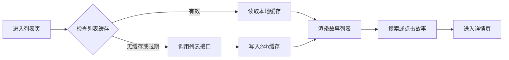
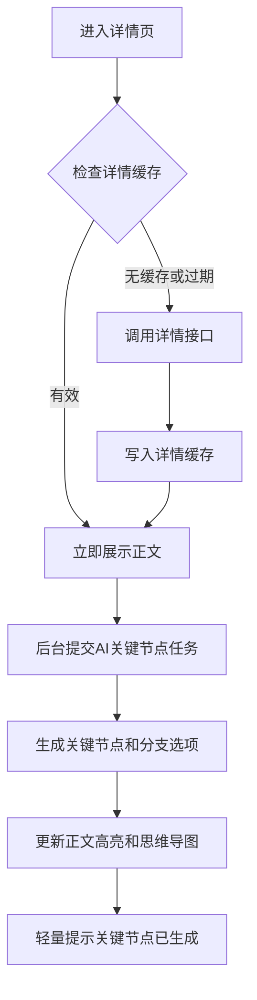
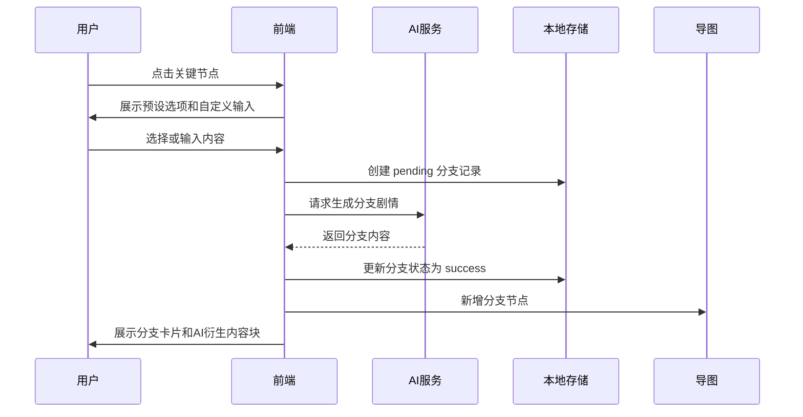

# 互动式小说产品需求交互设计文档（PRD）- V1.2 优化版

**文档版本：** V1.2  
**文档日期：** 2026年5月12日  
**适用阶段：** MVP 产品定义 + 技术方案评审  
**基于文档：** 《互动式小说产品需求交互设计文档（PRD）- V1.1》及补充产品思路  

## 修订说明

- 明确 P0 / P1 / P2 功能边界，收敛首版范围。
- 保留“正文优先、AI 后台静默分析”的核心体验原则。
- 统一知乎接口 24 小时强制缓存规则，并补充允许例外。
- 新增 AI 输出结构化协议，包括关键节点、分支、思维导图、世界观分析。
- 明确原始正文与 AI 衍生内容的展示和存储关系。
- 补充 AI 任务优先级、成本控制、模型适配层与缓存策略。
- 简化 MVP 思维导图交互，避免首版变成复杂图编辑器。
- 补充内容安全、版权边界、埋点指标和验收标准。

---

## 一、项目概述

### 1.1 项目背景

基于知乎盐言故事开放内容库，通过 AI 互动叙事能力，将传统线性短篇阅读升级为“可以选择剧情的互动式小说”体验。读者在阅读过程中可以在关键剧情节点做选择，AI 根据原文、世界观、人物关系和用户选择生成对应分支，让每一次阅读形成不同的故事走向。

项目目标不是简单给小说增加 AI 聊天能力，而是让读者在不破坏原文阅读体验的前提下，参与剧情走向、探索分支内容，并通过思维导图快速理解和切换不同故事路径。

### 1.2 产品定位

**一句话定位：**

> 基于知乎盐言故事的 AI 互动阅读产品，让读者在关键节点选择剧情，生成属于自己的故事分支。

**核心价值：**

- 对读者：从被动阅读转为参与剧情选择，获得更强沉浸感和重读价值。
- 对内容方：延长单篇故事消费时长，拓展多结局、多番外、多续写的内容形态。
- 对平台：验证盐言故事与 AI 互动叙事结合的可行性，为后续互动 IP、作者工具、社区分享打基础。

### 1.3 产品原则

1. **阅读优先**  
   进入详情页后优先展示原文，AI 分析不得阻塞阅读。

2. **互动克制**  
   关键节点高亮要少而准，不把正文变成到处可点的游戏界面。

3. **原文不可破坏**  
   原始正文永远保持独立和可恢复，AI 生成内容作为衍生层展示和存储。

4. **导图服务阅读**  
   思维导图的核心是总览、定位、切换分支，不承担复杂图编辑功能。

5. **成本可控**  
   AI 任务按优先级分层，避免进入详情页即触发所有长文本分析。

### 1.4 用户画像

- **核心用户：** 18-35 岁，对言情、悬疑、现实题材感兴趣的知乎盐选会员用户，偏好强情绪、强代入、多结局探索。
- **重要用户：** 网文重度读者，对互动叙事、橙光类玩法、游戏化阅读有兴趣。
- **机会用户：** 内容编辑、创作者，希望借助 AI 探索角色关系、番外、续写和多结局。

---

## 二、MVP 范围定义

### 2.1 P0 必须完成

P0 的目标是验证核心闭环：

> 用户进入故事详情页后，可以阅读原文，在少量关键节点做选择，AI 生成分支内容，并在思维导图中形成可定位、可查看的分支。

P0 包含：

- 列表页展示盐言故事列表。
- 列表和详情接口强制本地缓存 24 小时。
- 搜索故事标题和简介。
- 详情页展示正文、作者、导语、标签。
- 进入详情页后，AI 后台提炼关键节点，不阻塞阅读。
- 正文中展示少量高置信关键节点高亮和分支 icon。
- 点击关键节点后展示 2-3 个 AI 预设选项和一个自定义输入框。
- 选择或输入后生成 AI 分支剧情。
- 右侧分支面板展示选择记录、生成状态和生成内容。
- 右上角思维导图展示原文结构和用户生成分支。
- 思维导图支持全屏查看和点击节点定位正文。
- 正文末尾提供“番外”“续写”按钮，复用分支生成链路。
- 刘看山作为轻量引导和状态提示。
- AI 失败、缓存异常、存储过载等基础异常处理。

### 2.2 P0 暂缓

以下能力不进入首版：

- 复杂右键菜单。
- 拖动节点自定义布局。
- 双击节点详情卡片。
- 节点搜索。
- 用户编辑 AI 节点。
- 多版本复杂切换和回滚。
- 分支热力图。
- 社区分享用户故事版本。
- 人物插画、多模态生成。
- 完整人物关系网默认展示。
- 每个 NPC、物品的完整小传默认生成。

### 2.3 P1 / P2 / P3 路线

| 阶段 | 目标 | 功能 |
|---|---|---|
| P0 | 验证互动阅读闭环 | 列表、详情、缓存、关键节点、分支生成、基础导图、番外/续写 |
| P1 | 增强可编辑和可管理能力 | 用户编辑节点、修改 AI 内容、保存多个分支版本、节点搜索 |
| P2 | 增强内容生产能力 | 完整关系网、人物小传深钻、更多番外推荐、多模态角色图 |
| P3 | 增强传播和生态 | 用户故事版本分享、分支热力图、作者合作定制互动大纲 |

---

## 三、核心页面与功能

## 3.1 列表页

### 3.1.1 页面目标

帮助用户快速浏览盐言故事库，通过搜索找到想体验互动玩法的故事，并进入详情页。

### 3.1.2 页面结构

| 区域 | 内容 |
|---|---|
| 顶部导航 | Logo、产品名称“知乎·盐言·互动阅读”、个人入口 |
| 搜索区 | 搜索输入框、搜索按钮或实时筛选 |
| 故事列表 | 卡片式展示故事封面、标题、简介、标签 |
| 刘看山引导 | 右下角轻量提示 |

### 3.1.3 功能规格

**故事列表：**

- 从接口获取盐言故事概要列表。
- 展示字段包括 `work_id`、`title`、`artwork`、`tab_artwork`、`description`、`labels`。
- 列表顺序与内容库固定表顺序一致。
- 点击故事卡片进入详情页。

**搜索：**

- 支持按标题、简介模糊搜索。
- 输入防抖 300ms。
- 无结果时展示空状态。
- P0 不做复杂筛选和个性化排序。

**刘看山引导：**

- 首次进入列表页 5-10 秒后出现一次。
- 文案示例：“选一本你喜欢的盐言故事，开始你的分支剧情。”
- 用户关闭后，本次会话不再重复弹出。

---

## 3.2 详情页

### 3.2.1 页面目标

详情页是核心体验页，需要同时满足：

- 顺畅阅读原文。
- 在关键节点进行互动选择。
- 查看 AI 生成分支。
- 通过思维导图总览和定位故事结构。
- 在正文末尾触发番外/续写。

### 3.2.2 P0 页面布局

P0 建议采用“正文主区域 + 右侧辅助区域”的布局，而不是过早固定复杂三栏。

```text
┌──────────────────────────────────────────────────────────────┐
│ 顶部导航：返回 / 故事标题 / 作者 / 标签 / 数据来源             │
├──────────────────────────────────────┬───────────────────────┤
│                                      │ 右上：思维导图小窗      │
│ 正文阅读区                            │ [全屏查看]             │
│ - 导语                                ├───────────────────────┤
│ - 正文段落                            │ 右下：分支记录面板      │
│ - 关键节点高亮                        │ - 选择内容             │
│ - AI 衍生内容块                       │ - 生成状态             │
│ - 番外 / 续写按钮                     │ - 生成结果             │
└──────────────────────────────────────┴───────────────────────┘
```

### 3.2.3 正文展示

- 根据详情接口获取 `work_id`、`chapter_name`、`author_avatar`、`author_name`、`labels`、`introduction`、`content`。
- `content` 按段落解析展示。
- 正文行高建议 1.6-1.8。
- 正文字号建议 18-20px。
- 原始正文只读，不被 AI 内容覆盖或改写。

### 3.2.4 AI 后台分析

用户进入详情页后：

1. 优先从缓存读取并展示正文。
2. 正文展示完成后，后台启动 AI 分析任务。
3. AI 生成关键节点和分支预设。
4. 生成完成后，轻量提示用户“关键节点已生成，点击查看”。
5. 思维导图更新节点。
6. 正文高亮关键节点。

**展示原则：**

- 不弹出阻塞弹窗。
- 不展示全屏 Loading。
- 不打断用户滚动和阅读。
- 仅在右下角刘看山附近展示轻提示。

### 3.2.5 关键节点规则

AI 从以下维度识别关键节点：

- 情节转折点。
- 人物关键对话或行动。
- 情绪峰值点。
- 信息爆点。
- 结局前关键选择点。
- 适合分支改写的开放性节点。

P0 限制：

- 每篇故事默认生成 3-8 个关键节点。
- 默认只在正文高亮高置信节点。
- 次级节点可进入思维导图，但不一定在正文高亮。
- 每个关键节点必须绑定稳定锚点，不只依赖段落索引。

### 3.2.6 分支交互

点击正文关键节点后，展示分支选择弹窗或浮层：

- 2-3 个 AI 预设选项。
- 1 个自定义输入框。
- 用户可选择预设，也可输入自己的选择。
- 提交后在右侧分支面板新增一张生成卡片。
- 卡片先展示用户选择，再展示生成状态，最后展示 AI 分支内容。
- 生成成功后，思维导图对应节点下新增分支子节点。

**分支卡片状态：**

- `pending`：已提交，等待任务开始。
- `generating`：AI 正在生成。
- `success`：生成成功。
- `failed`：生成失败，可重试。
- `cancelled`：用户取消或任务终止。

### 3.2.7 原文与 AI 衍生内容展示关系

为避免 AI 内容破坏原文，详情页正文分为两层：

1. **原始正文层**  
   来自知乎接口，永远保持不变。

2. **AI 衍生内容层**  
   用户选择后的分支、番外、续写，作为独立内容块展示。

交互规则：

- 节点分支生成后，可在对应原文节点下方展示“AI 分支内容块”。
- 右侧分支面板始终保留生成记录。
- 番外和续写默认追加到正文末尾的“AI 衍生内容区”。
- 切换分支时，只切换当前可见的 AI 衍生内容块，不改写原文。

---

## 3.3 思维导图

### 3.3.1 核心定位

思维导图用于：

- 总览故事结构。
- 快捷定位正文关键节点。
- 展示用户选择后的分支走向。
- 切换查看不同 AI 衍生内容。

P0 不把思维导图做成复杂图编辑器。

### 3.3.2 P0 功能

- 右上角小窗展示故事根节点和关键节点。
- 支持点击全屏查看。
- 全屏模式下展示更完整的树形结构。
- 点击节点，正文滚动到对应位置。
- 用户生成分支后，在源节点下新增子节点。
- 番外/续写生成后，追加到对应番外或续写节点。
- 支持收起回右上角。

### 3.3.3 P0 暂缓功能

- 右键菜单。
- 拖动节点布局。
- 双击查看节点详情。
- 节点搜索。
- 用户编辑节点。
- 复杂版本回滚。

### 3.3.4 节点类型

| 类型 | 说明 | P0 是否展示 |
|---|---|---|
| `root` | 故事根节点 | 是 |
| `story_node` | 原文关键节点 | 是 |
| `branch_point` | 可选择分支的节点 | 是 |
| `branch` | 用户选择后生成的分支 | 是 |
| `extra` | 番外节点 | 是 |
| `continuation` | 续写节点 | 是 |
| `world` | 世界观节点 | P1 |
| `character` | 人物节点 | P1 |
| `object` | 物品节点 | P2 |

---

## 3.4 番外与续写

### 3.4.1 入口

正文末尾展示两个按钮：

- 番外
- 续写

### 3.4.2 番外

番外用于生成不改变主线的衍生内容。

流程：

1. 用户点击“番外”。
2. AI 基于原文摘要、世界观、人物设定生成 2-3 个番外方向。
3. 用户选择预设方向或输入自定义方向。
4. AI 生成番外内容。
5. 内容追加到正文末尾“AI 衍生内容区”。
6. 思维导图新增番外节点。

### 3.4.3 续写

续写用于从当前故事末尾或当前分支继续推进剧情。

流程：

1. 用户点击“续写”。
2. AI 根据当前阅读位置、当前分支路径、原文摘要生成 2-3 个续写方向。
3. 用户选择预设方向或输入自定义方向。
4. AI 生成续写内容。
5. 内容追加到当前分支路径下。
6. 思维导图新增续写节点。

### 3.4.4 底层模型

番外、续写和节点分支复用同一个 `Branch` 数据模型，通过 `branch_type` 区分：

- `node_branch`：正文关键节点分支。
- `extra`：番外。
- `continuation`：续写。

---

## 四、数据与缓存设计

## 4.1 知乎接口缓存

### 4.1.1 核心规则

列表接口和详情接口都必须强制本地缓存 24 小时。

默认规则：

- 缓存有效期内，普通刷新、重新进入页面、下拉刷新都只读取本地缓存。
- 缓存不存在或已过期时，才允许请求远程 API。
- 请求成功后写入缓存，并重置 24 小时倒计时。

### 4.1.2 允许例外

以下场景允许绕过缓存：

- 缓存不存在。
- 缓存已过期。
- 缓存数据损坏或结构不合法。
- 管理员或调试模式主动强制刷新。
- 产品开关明确开启“立即更新”能力。

P0 建议普通用户侧不默认展示“立即更新”，避免破坏接口调用限制。

### 4.1.3 缓存键

| 数据 | 缓存键 | 有效期 |
|---|---|---|
| 故事列表 | `yyan_story_list_v1` | 24 小时 |
| 故事详情 | `yyan_story_detail_{work_id}` | 24 小时 |

### 4.1.4 列表缓存结构

```json
{
  "data": [],
  "cached_at": 1778550000000,
  "expires_at": 1778636400000,
  "source": "remote_api"
}
```

### 4.1.5 详情缓存结构

```json
{
  "work_id": "1644038836790169600",
  "data": {
    "chapter_name": "第一章",
    "author_avatar": "https://picx.zhimg.com/...",
    "author_name": "六酒",
    "labels": ["史脑洞"],
    "introduction": "导语文本",
    "content": "第一段正文\n第二段正文"
  },
  "cached_at": 1778550000000,
  "expires_at": 1778636400000,
  "content_hash": "sha256_xxx"
}
```

---

## 4.2 AI 结果缓存

除知乎接口缓存外，AI 分析结果也必须缓存，避免同一篇故事重复分析。

### 4.2.1 缓存维度

AI 缓存键应包含：

- `work_id`
- `content_hash`
- `prompt_version`
- `model`
- `task_type`

### 4.2.2 缓存键示例

```text
ai_analysis_{work_id}_{content_hash}_{prompt_version}_{model}
ai_key_nodes_{work_id}_{content_hash}_{prompt_version}_{model}
ai_world_{work_id}_{content_hash}_{prompt_version}_{model}
```

### 4.2.3 AI 缓存结构

```json
{
  "cache_key": "ai_key_nodes_1644038836790169600_sha256_xxx_v1_deepseek",
  "work_id": "1644038836790169600",
  "content_hash": "sha256_xxx",
  "task_type": "key_nodes",
  "prompt_version": "v1",
  "model": "deepseek",
  "data": [],
  "cached_at": 1778550000000
}
```

---

## 4.3 分支会话与版本

### 4.3.1 基本原则

- 原始正文是基础版本，不被修改。
- 用户每次分支选择都形成独立 `Branch`。
- 一个阅读会话可以包含多个分支。
- P0 先不做复杂版本回滚，只保存当前会话的分支历史和可见状态。

### 4.3.2 会话结构

```json
{
  "session_id": "session_001",
  "work_id": "1644038836790169600",
  "base_content_hash": "sha256_xxx",
  "active_branch_ids": ["branch_001", "branch_002"],
  "branch_history": [],
  "graph_data": {
    "nodes": [],
    "edges": []
  },
  "created_at": 1778550000000,
  "updated_at": 1778550300000
}
```

---

## 五、AI 能力设计

## 5.1 模型选型

默认策略：

- DeepSeek 作为主模型。
- 豆包作为备用降级模型。
- 业务层通过统一模型适配层调用，不直接绑定某个模型 API。

### 5.1.1 使用建议

| 场景 | 默认模型 | 说明 |
|---|---|---|
| 关键节点提炼 | DeepSeek | 重视长文本理解和结构化输出 |
| 分支选项生成 | DeepSeek | 成本低，适合高频调用 |
| 分支剧情生成 | DeepSeek | 需要控制输出结构和文风 |
| 模型超时或限流 | 豆包 | 作为降级保障 |
| 内容安全链路 | 按平台能力选择 | 可独立接入审核服务 |

### 5.1.2 模型适配层

```ts
interface StoryAIProvider {
  analyzeStory(input: AnalyzeStoryInput): Promise<StoryAnalysis>;
  generateKeyNodes(input: KeyNodeInput): Promise<KeyNode[]>;
  generateBranchOptions(input: BranchOptionInput): Promise<BranchOption[]>;
  generateBranchContent(input: BranchGenerateInput): Promise<BranchResult>;
  generateExtraOrContinuation(input: ExtraInput): Promise<BranchResult>;
}
```

---

## 5.2 AI 任务优先级

### 5.2.1 P0 必须执行

- 基础故事摘要。
- 关键节点提炼。
- 关键节点分支选项生成。
- 用户选择后的分支剧情生成。
- 番外/续写方向生成。
- 番外/续写正文生成。

### 5.2.2 P0 低优先级后台执行

- 宏观世界观摘要。
- 主要人物简表。

### 5.2.3 P1 或按需执行

- 完整人物小传。
- NPC 小传。
- 物品小传。
- 关系网。
- 分场景、分时段世界观。
- 用户深钻某个人物后的背景故事。

---

## 5.3 AI 输出结构化协议

AI 所有核心输出必须是结构化 JSON，不允许只返回自然语言后再由前端猜测解析。

### 5.3.1 StoryAnalysis

```json
{
  "work_id": "1644038836790169600",
  "content_hash": "sha256_xxx",
  "model": "deepseek",
  "prompt_version": "v1",
  "story_summary": "故事主线摘要",
  "world_summary": "宏观世界观摘要",
  "tone": "悬疑 / 言情 / 现实 / 脑洞",
  "characters": [
    {
      "character_id": "char_001",
      "name": "林夏",
      "role": "主角",
      "personality": "敏感、谨慎、行动力强",
      "motivation": "寻找真相并保护自己",
      "speech_style": "克制、短句多"
    }
  ],
  "relations": [
    {
      "from": "char_001",
      "to": "char_002",
      "relation": "前任 / 盟友 / 对立 / 暗恋"
    }
  ],
  "locations": [],
  "objects": []
}
```

### 5.3.2 KeyNode

```json
{
  "node_id": "node_001",
  "title": "主角发现关键证据",
  "summary": "主角在对话中发现隐藏线索，剧情发生转折。",
  "importance": "main",
  "node_type": "turning_point",
  "paragraph_index": 12,
  "char_range": [20, 48],
  "anchor_text": "她终于意识到，所有线索都指向同一个人。",
  "quote_hash": "sha256_xxx",
  "confidence": 0.92,
  "branch_options": [
    {
      "option_id": "opt_001",
      "text": "立刻质问对方",
      "tone": "冲突升级"
    },
    {
      "option_id": "opt_002",
      "text": "假装不知道，继续调查",
      "tone": "悬疑推进"
    },
    {
      "option_id": "opt_003",
      "text": "向朋友求助",
      "tone": "关系扩展"
    }
  ]
}
```

### 5.3.3 Branch

```json
{
  "branch_id": "branch_001",
  "branch_type": "node_branch",
  "source_node_id": "node_001",
  "choice_type": "preset",
  "choice_text": "假装不知道，继续调查",
  "status": "success",
  "generated_content": "她压下心里的震惊，装作若无其事地移开视线……",
  "summary": "主角选择隐藏情绪，进入继续调查路线。",
  "created_at": 1778550000000,
  "model": "deepseek",
  "prompt_version": "v1"
}
```

### 5.3.4 MindMapNode

```json
{
  "id": "map_node_001",
  "parent_id": "root",
  "type": "branch",
  "label": "假装不知道",
  "summary": "主角选择继续调查，进入隐藏线。",
  "target_paragraph_index": 12,
  "branch_id": "branch_001"
}
```

---

## 六、交互流程

### 6.1 列表页流程



### 6.2 详情页初始化流程



### 6.3 分支生成流程



---

## 七、视觉与引导

### 7.1 视觉原则

- 延续知乎和盐言的清爽阅读感。
- 正文区域保持安静，不使用过多动效。
- AI 互动元素有明显识别，但不能抢正文注意力。
- 思维导图视觉轻量，默认作为辅助工具。

### 7.2 颜色建议

| 元素 | 建议 |
|---|---|
| 品牌主色 | 知乎蓝 |
| 分支点 | 紫色系 |
| AI 衍生节点 | 橙色系 |
| 成功状态 | 绿色 |
| 警告 / Loading | 琥珀色 |
| 正文背景 | 柔白或浅灰 |

### 7.3 刘看山引导

刘看山定位为轻量陪伴和状态提示，不作为强打扰弹窗。

建议出现时机：

- 列表页首次进入。
- 详情页关键节点生成完成。
- 分支生成中或生成完成。
- AI 生成失败。
- 高频连续互动或深夜使用提醒。

限制：

- 用户关闭后，本次会话不再反复弹出。
- 不在正文阅读过程中频繁出现营销式气泡。
- 文案保持克制，不制造焦虑或强诱导。

---

## 八、状态与异常处理

| 状态 | 展示 | 处理 |
|---|---|---|
| 列表缓存命中 | 数据来自本地缓存，上次更新 xx | 正常展示，不请求远程 API |
| 详情缓存命中 | 右上角弱提示本地缓存 | 正常展示正文 |
| 缓存过期 | 静默请求接口 | 成功后刷新缓存 |
| 缓存损坏 | 提示缓存异常，将重新获取 | 清除缓存并请求接口 |
| API 失败 | 内容获取失败，请稍后重试 | 若有旧缓存则展示旧缓存并标记离线 |
| AI 分析中 | 右下角轻提示或小圆点 | 不阻塞阅读 |
| AI 分析完成 | 关键节点已生成，点击查看 | 更新高亮和导图 |
| 分支生成中 | 分支卡片 Loading | 正文可继续阅读 |
| 分支生成失败 | 生成失败，换一种方式试试 | 支持重试、修改输入、删除 |
| 关键节点为空 | 暂未发现合适互动点 | 保留番外/续写入口 |
| 本地存储过载 | 提示清理历史分支 | 支持清理 30 天前会话 |

---

## 九、安全与合规

### 9.1 AI 内容安全

需要对以下内容进行安全控制：

- 用户自定义输入。
- AI 分支生成结果。
- 番外和续写内容。
- 多轮连续生成中的上下文。

建议接入：

- 敏感内容审核。
- 高危情绪识别。
- 未成年人保护提示。
- 违规内容拒答或改写。

### 9.2 版权边界

- 原始正文与 AI 生成内容必须明确区分。
- AI 生成内容应标注为“AI 衍生内容”。
- 分享时应区分原文内容和用户生成分支。
- 不应暗示 AI 生成内容来自原作者。

### 9.3 沉迷与情感依赖

触发条件：

- 连续生成分支超过一定次数。
- 深夜长时间使用。
- 用户输入高危情绪表达。

处理方式：

- 刘看山轻提醒休息。
- 降低互动诱导。
- 必要时中断 AI 拟人化回复。

---

## 十、埋点与评估指标

### 10.1 阅读指标

- 列表页曝光。
- 故事卡片点击率。
- 详情页打开成功率。
- 正文阅读停留时长。
- 正文滚动深度。

### 10.2 AI 节点指标

- 关键节点生成成功率。
- 关键节点生成耗时。
- 关键节点数量。
- 关键节点点击率。
- 节点高亮曝光到点击转化率。

### 10.3 分支互动指标

- 分支选项点击率。
- 自定义输入使用率。
- 分支生成成功率。
- 分支生成平均耗时。
- 分支内容重生成率。
- 分支内容删除率。
- 单篇故事平均分支数。

### 10.4 思维导图指标

- 思维导图曝光率。
- 全屏打开率。
- 节点点击定位率。
- 分支节点查看率。

### 10.5 番外 / 续写指标

- 番外点击率。
- 续写点击率。
- 番外生成成功率。
- 续写生成成功率。
- 番外 / 续写阅读完成率。

---

## 十一、验收标准

### 11.1 P0 产品验收

- 用户可以从列表页进入任意故事详情页。
- 列表和详情数据遵循 24 小时缓存规则。
- 详情页正文可优先展示，不被 AI 分析阻塞。
- AI 能生成 3-8 个关键节点。
- 正文能展示关键节点高亮和分支 icon。
- 用户点击关键节点后能看到 2-3 个预设选项和自定义输入框。
- 用户提交选择后，右侧能展示生成状态和结果。
- 思维导图能新增对应分支节点。
- 番外和续写能生成并追加到 AI 衍生内容区。
- AI 失败不会影响原文阅读。

### 11.2 技术验收

- AI 输出符合结构化 schema。
- 分支、导图、正文锚点之间通过稳定 ID 关联。
- 原始正文与 AI 衍生内容分离存储。
- AI 结果缓存可命中，重复进入详情不重复分析。
- DeepSeek 与豆包通过统一适配层接入。
- 关键异常都有可恢复路径。

### 11.3 体验验收

- 首屏正文展示快于 AI 节点生成。
- 关键节点提示不打断阅读。
- 刘看山提示频率可控。
- 思维导图能帮助用户定位和理解分支。
- 分支生成中用户仍可继续阅读。

---

## 十二、待确认问题

1. “立即更新”是否对普通用户开放，还是仅作为调试或运营能力？
2. P0 是否需要支持移动端，若支持，右侧分支面板和思维导图需要重新设计布局。
3. AI 生成内容是否允许分享，分享时是否带原文片段？
4. 单个用户、单篇故事最多保留多少分支记录？
5. 番外和续写的最长生成字数是多少？
6. 是否需要对不同题材设置不同提示词模板？
7. 是否有统一内容安全审核接口可用？
8. 刘看山素材是否已有静态图和 Lottie 动画资源？

---

## 十三、总结

V1.2 的核心不是增加更多功能，而是把 V1.1 中已经成立的方向收敛为可实现、可验收、可控成本的 MVP。

第一版最重要的产品闭环是：

> 读者进入正文，看到少量关键节点，做出选择，AI 生成分支，分支进入正文衍生内容区和思维导图。

世界观、人物小传、关系网、复杂版本管理都可以增强体验，但不应抢占首版核心路径。首版应集中火力把“选择剧情并看到结果”做顺、做稳、做可复用。
