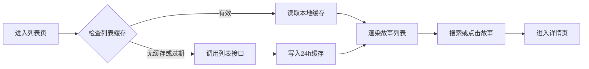
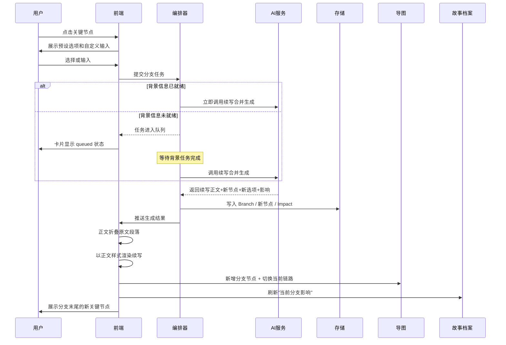
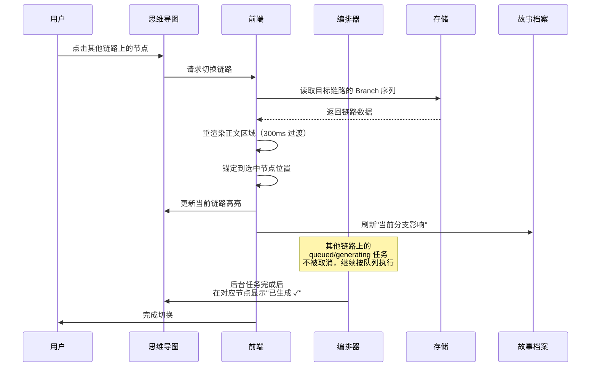
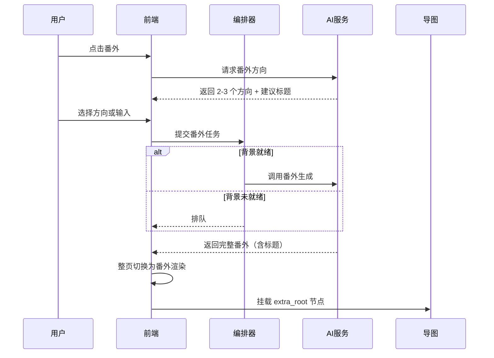

# 互动式小说产品需求交互设计文档（PRD）- V1.3

**文档版本：** V1.3
**文档日期：** 2026年5月13日
**适用阶段：** MVP 产品定义 + 技术方案评审
**基于文档：** 《互动式小说产品需求交互设计文档（PRD）- V1.2 优化版》

## 修订说明（V1.2 → V1.3）

V1.3 是一次**模型级**变更，核心是修正 V1.2 中"原文 + AI 衍生卡片叠加"的叙事错位问题，并补齐世界观背景信息的预生成与展示链路。

### 关键变更摘要

1. **分支模型从"叠加"改为"替换"**
   - 用户在关键节点选择后，原文从该节点之后被"折叠"，由 AI 续写以正文样式无缝衔接。
   - AI 续写不再用卡片渲染，与原文同字号、同行高、同排版。
   - 卡片仅承载元信息（生成状态、操作入口）和番外侧栏内容。

2. **续写采用"节点驱动"生成**
   - 单次续写一次性返回：续写正文 + 1 个新关键节点 + 2-3 个分支预设。
   - 形成"读一段→选一次→再读一段"的节奏。
   - 通过最大分支深度、单节点重生成次数等硬约束控制成本。

3. **思维导图升级为"分支切换中心"**
   - 不仅锚定位置，还作为切换不同剧情链路的入口。
   - 点击节点高亮当前选中的整条链路并锚定到节点位置。
   - 支持同会话内多条平行剧情树的可视化与切换。

4. **番外重新定义为"标题级分支"**
   - 番外是对整篇故事标题的分叉，正文也被替换。
   - 例如：原标题"秦始皇登月计划" → 番外标题"番外：秦始皇的日常生活"。
   - 番外内部不再生成关键节点，一次性生成到番外故事结束。

5. **背景信息（世界观/人物/关系网/物品）从 P1 升级为 P0 静默预生成**
   - 进入详情页后，后台静默生成全套背景信息。
   - 在专属"故事档案"侧栏中展示。
   - 分支续写必须等待背景信息生成完成后才能开始，确保剧情符合世界观。

6. **新增 AI 任务编排与队列机制**
   - 明确背景信息任务、关键节点任务、分支续写任务的优先级与依赖关系。
   - 用户触发分支但背景信息未完成时，分支生成进入等待队列。

7. **新增故事档案侧栏（3.5）**
   - 提供宏观世界观、全部人物表、人物小传、NPC 小传、物品小传、关系网、分场景/分时段世界观、当前分支产生的世界影响等信息的展示入口。

### V1.3 决策落实补丁（2026-05-13）

V1.3 初稿提出的 12 个待确认问题已逐项确认，相关章节已同步更新。核心决策摘要：

| 编号 | 决策 | 落实章节 |
|---|---|---|
| 1 | AI 共享缓存采用"服务端本地文件 + 按日同步 CDN"方案，不引入数据库 | 4.2 |
| 2 | "立即更新"仅作为运营/调试能力，不对普通用户开放 | 4.1.2 |
| 3 | P0 仅适配 PC Web，不做移动端 | 1.5 / 2.2 / 3.2.2 |
| 4 | P0 不开放分享能力 | 2.2 / 9.2 |
| 5 | 最大分支深度 5 层（明确为"从原文起向下嵌套的分支层数"） | 3.2.6 |
| 6 | 番外单篇字数上限 5000 字 | 3.4.2 |
| 7 | Prompt 模板分大类（言情/悬疑/史脑洞/现实/其他）+ 通用模板 | 5.5.5 |
| 8 | P0 不接入内容安全审核，沉迷提醒降级到 P1 | 第九章 |
| 9 | 刘看山形象使用《刘看山围脖四视图.png》四视角素材 | 7.3 |
| 10 | 切换链路不自动取消进行中的生成任务，任务按队列顺序继续执行，完成后用户可切换查看 | 3.2.8 / 3.3.6 |
| 11 | 同 3，故事档案侧栏仅做 PC 端 | 3.5.2 |
| 12 | "当前分支影响"不做差异对比展示，直接展示当前链路的累积影响 | 3.5.6 |

文档第十二章已从"待确认问题"改为"已确认决策"。

---

## 一、项目概述

### 1.1 项目背景

基于知乎盐言故事开放内容库，通过 AI 互动叙事能力，将传统线性短篇阅读升级为"可以选择剧情的互动式小说"体验。读者在阅读过程中可以在关键剧情节点做选择，AI 根据原文、世界观、人物关系和用户选择生成对应分支，让每一次阅读形成不同的故事走向。

V1.3 在 V1.2 基础上，强化了"互动"对故事时间线的真实改写能力，并补齐了支撑高质量分支续写所必须的世界观背景信息体系。

### 1.2 产品定位

**一句话定位：**

> 基于知乎盐言故事的 AI 互动阅读产品，让读者在关键节点选择剧情，生成属于自己的、符合原作世界观的故事分支。

**核心价值：**

- 对读者：从被动阅读转为参与剧情选择，获得更强沉浸感、更真实的世界观代入感和重读价值。
- 对内容方：延长单篇故事消费时长，拓展多结局、多番外、多续写的内容形态。
- 对平台：验证盐言故事与 AI 互动叙事结合的可行性，为后续互动 IP、作者工具、社区分享打基础。

### 1.3 产品原则

1. **阅读优先**
   进入详情页后优先展示原文，AI 分析不得阻塞阅读。

2. **互动真实**
   用户的选择必须真正改写故事时间线，而不是作为原文的"批注"。

3. **世界观一致**
   分支续写必须依据已生成的世界观、人物、关系、物品背景，避免 AI"自由发挥"破坏原作设定。

4. **互动克制**
   关键节点高亮少而准，不把正文变成到处可点的游戏界面。

5. **原文可恢复**
   原始正文永远保留在数据层，用户可通过思维导图随时切回主线或其他分支链路。

6. **导图服务阅读**
   思维导图的核心是总览、定位、切换链路，不承担复杂图编辑功能。

7. **成本可控**
   AI 任务按优先级与依赖分层执行，背景信息复用缓存，深度分支有硬约束。

### 1.4 用户画像

- **核心用户：** 18-35 岁，对言情、悬疑、现实题材感兴趣的知乎盐选会员用户，偏好强情绪、强代入、多结局探索。
- **重要用户：** 网文重度读者，对互动叙事、橙光类玩法、游戏化阅读有兴趣。
- **机会用户：** 内容编辑、创作者，希望借助 AI 探索角色关系、番外、续写和多结局。

### 1.5 终端范围

- **P0 仅适配 PC Web 端。** 详情页布局、故事档案侧栏、思维导图、分支面板等都按 PC 宽屏体验设计，最小分辨率 1280x800。
- 移动端、平板适配在 P1 之后另行评估，不在本版 PRD 范围内。

---

## 二、MVP 范围定义

### 2.1 P0 必须完成

P0 的目标是验证核心闭环：

> 用户进入故事详情页后，可以阅读原文；后台自动生成世界观背景；在少量关键节点做选择，AI 基于背景信息真实改写后续剧情；通过思维导图随时切换不同剧情链路。

P0 包含：

**阅读与缓存**

- 列表页展示盐言故事列表。
- 列表和详情接口强制本地缓存 24 小时。
- 搜索故事标题和简介。
- 详情页展示正文、作者、导语、标签。

**关键节点与分支**

- 进入详情页后，AI 后台提炼原文关键节点，不阻塞阅读。
- 正文中展示少量高置信关键节点高亮和分支 icon。
- 点击关键节点后展示 2-3 个 AI 预设选项和一个自定义输入框。
- 选择或输入后生成 AI 分支续写。
- **分支替换模型**：分支生成后，原文从该节点之后视觉折叠，AI 续写以正文样式无缝衔接。
- 单次续写一次性返回：续写正文 + 1 个新关键节点 + 2-3 个分支预设。
- 最大分支深度 5 层。

**故事档案侧栏（新增）**

- 进入详情页后，后台静默生成世界观、全部人物表、人物小传、NPC 小传、物品小传、关系网、分场景/分时段世界观。
- 故事档案侧栏入口在详情页右侧或顶部导航。
- 用户可随时打开侧栏查看背景信息。
- 当前分支产生的世界影响（人物状态变化、关系变化、新增事件）实时展示。

**思维导图（升级）**

- 右上角思维导图展示原文结构、用户生成分支、平行链路。
- 思维导图支持全屏查看。
- 点击节点：正文滚动到对应位置 + 高亮该节点所在的整条链路 + 切换正文显示该链路。
- 支持同会话内多条平行剧情树的展示。

**番外与续写**

- 正文末尾或思维导图根节点提供"番外"入口：番外作为标题级分支，替换原文正文，不生成关键节点，一次性生成。
- 分支末端或正文末尾提供"续写"入口：续写复用分支续写模型（节点驱动）。

**AI 任务编排**

- 进入详情页后并行启动：基础摘要、世界观背景、人物背景、关键节点四类任务。
- 分支续写任务依赖背景信息任务，若背景未完成则排队等待。
- 用户在等待时可继续阅读、查看已有分支、操作思维导图。

**其他**

- 刘看山作为轻量引导和状态提示。
- AI 失败、缓存异常、存储过载等基础异常处理。

### 2.2 P0 暂缓

以下能力不进入首版：

- **移动端、平板端适配**（P0 仅 PC Web）。
- **分享能力**（含分支链路分享、故事档案分享、番外分享）。
- **内容安全审核接入**（敏感词、未成年保护、高危情绪识别等）。
- **沉迷与情感依赖提醒**。
- 复杂右键菜单。
- 拖动节点自定义布局。
- 双击节点详情卡片。
- 节点搜索。
- 用户编辑 AI 节点或 AI 续写正文。
- 跨会话的多版本复杂回滚。
- 分支热力图。
- 社区分享用户故事版本。
- 人物插画、多模态生成。
- 用户主动追加新人物、新物品到故事档案。
- 故事档案的可编辑能力。

### 2.3 P1 / P2 / P3 路线

| 阶段 | 目标 | 功能 |
|---|---|---|
| P0 | 验证互动阅读闭环 | 列表、详情、缓存、关键节点、分支替换、故事档案、链路切换、番外/续写 |
| P1 | 增强可编辑和可管理能力 | 用户编辑节点、修改 AI 内容、保存多个会话版本、节点搜索、故事档案编辑 |
| P2 | 增强内容生产能力 | 人物插画、多模态角色图、深度番外推荐、关系网可视化 |
| P3 | 增强传播和生态 | 用户故事版本分享、分支热力图、作者合作定制互动大纲 |

---

## 三、核心页面与功能

## 3.1 列表页

### 3.1.1 页面目标

帮助用户快速浏览盐言故事库，通过搜索找到想体验互动玩法的故事，并进入详情页。

### 3.1.2 页面结构

| 区域 | 内容 |
|---|---|
| 顶部导航 | Logo、产品名称"知乎·盐言·互动阅读"、个人入口 |
| 搜索区 | 搜索输入框、搜索按钮或实时筛选 |
| 故事列表 | 卡片式展示故事封面、标题、简介、标签 |
| 刘看山引导 | 右下角轻量提示 |

### 3.1.3 功能规格

**故事列表：**

- 从接口获取盐言故事概要列表。
- 展示字段包括 `work_id`、`title`、`artwork`、`tab_artwork`、`description`、`labels`。
- 列表顺序与内容库固定表顺序一致。
- 点击故事卡片进入详情页。

**搜索：**

- 支持按标题、简介模糊搜索。
- 输入防抖 300ms。
- 无结果时展示空状态。
- P0 不做复杂筛选和个性化排序。

**刘看山引导：**

- 首次进入列表页 5-10 秒后出现一次。
- 文案示例："选一本你喜欢的盐言故事，开始你的分支剧情。"
- 用户关闭后，本次会话不再重复弹出。

---

## 3.2 详情页

### 3.2.1 页面目标

详情页是核心体验页，需要同时满足：

- 顺畅阅读原文。
- 在关键节点进行互动选择。
- 看到 AI 生成的、真正改写故事时间线的分支续写。
- 通过思维导图总览结构、定位节点、切换不同剧情链路。
- 通过故事档案侧栏查看世界观、人物、关系网等背景信息。
- 在正文末尾或分支末端触发番外/续写。

### 3.2.2 P0 页面布局

P0 采用"正文主区域 + 右侧辅助区域 + 故事档案抽屉"的布局，**仅适配 PC Web 端**（最小分辨率 1280x800，推荐 1440x900 及以上）。

```text
┌──────────────────────────────────────────────────────────────┐
│ 顶部导航：返回 / 故事标题 / 作者 / 标签 / 故事档案入口          │
├──────────────────────────────────────┬───────────────────────┤
│                                      │ 右上：思维导图小窗      │
│ 正文阅读区                            │ [全屏查看]             │
│ - 导语                                │ [当前链路高亮]          │
│ - 当前链路正文（原文 + AI 续写无缝）   ├───────────────────────┤
│ - 关键节点高亮                        │ 右下：分支记录面板      │
│ - 折叠的原文/其他分支提示             │ - 当前链路记录          │
│ - 番外 / 续写按钮                     │ - 生成状态             │
│                                      │ - 操作入口             │
└──────────────────────────────────────┴───────────────────────┘
            │
            │ 故事档案抽屉（从右侧或顶部唤出）
            ▼
┌──────────────────────────────────────────────────────────────┐
│ 故事档案：世界观 / 人物 / 关系网 / 物品 / 当前分支影响           │
└──────────────────────────────────────────────────────────────┘
```

### 3.2.3 正文展示

- 根据详情接口获取 `work_id`、`chapter_name`、`author_avatar`、`author_name`、`labels`、`introduction`、`content`。
- `content` 按段落解析展示。
- 正文行高建议 1.6-1.8。
- 正文字号建议 18-20px。
- **原文与 AI 续写在视觉上无缝衔接**，但通过细微的左侧色条或段落角标区分（详见 3.2.7）。
- 原始正文数据层只读，AI 续写作为独立分支数据存储，可随时切换回原文链路。

### 3.2.4 AI 后台分析

用户进入详情页后：

1. 优先从缓存读取并展示正文。
2. 正文展示完成后，后台并行启动四类 AI 任务：
   - **基础摘要任务**：生成故事摘要、基调、风格。
   - **世界观与背景任务**：生成宏观世界观、分场景世界观、物品志。
   - **人物与关系任务**：生成全部人物表、主要人物小传、NPC 小传、关系网。
   - **关键节点任务**：从原文提炼 3-8 个高置信关键节点和每个节点的 2-3 个分支预设。
3. 任务完成后：
   - 关键节点完成 → 正文高亮 + 思维导图更新 + 刘看山轻提示"关键节点已生成"。
   - 背景任务完成 → 故事档案侧栏入口显示"已就绪"标记。
4. **任务依赖**：用户触发的分支续写依赖背景任务全部完成（详见 5.4）。

**展示原则：**

- 不弹出阻塞弹窗。
- 不展示全屏 Loading。
- 不打断用户滚动和阅读。
- 仅在右下角刘看山附近、故事档案入口、思维导图小窗内展示轻提示。

### 3.2.5 关键节点规则

关键节点来源分为两类：

| 来源 | 说明 | 锚点字段 |
|---|---|---|
| `source = original` | 从原文提炼，绑定原文段落 | `paragraph_index`、`char_range`、`anchor_text`、`quote_hash` |
| `source = ai_continuation` | 从 AI 续写中产出，绑定续写段落 | `branch_id`、`ai_paragraph_id`、`anchor_text` |

AI 从以下维度识别关键节点：

- 情节转折点。
- 人物关键对话或行动。
- 情绪峰值点。
- 信息爆点。
- 适合分支改写的开放性节点。

P0 限制：

- 每篇故事原文默认生成 3-8 个关键节点。
- 每次 AI 续写默认产出 1 个新关键节点（如已到最大深度或情节自然收束，可为 0）。
- 每个关键节点必须绑定稳定锚点。
- 关键节点的 `depth` 字段记录其所在分支链路深度，原文节点 `depth = 0`。

### 3.2.6 分支交互（重写：分支替换模型）

点击正文关键节点后，展示分支选择浮层：

- 2-3 个 AI 预设选项。
- 1 个自定义输入框。
- 用户可选择预设，也可输入自己的选择。

提交后的处理流程：

1. **创建 Pending 分支记录**：右侧分支面板新增卡片，展示用户选择和"等待中"状态。
2. **检查任务依赖**：
   - 若背景信息尚未生成完成，分支任务进入队列，卡片展示"正在准备世界观背景，{n}/{m} 完成"。
   - 若已完成，立即调度分支续写任务。
3. **触发分支续写生成**：AI 一次性返回三件事——续写正文 + 1 个新关键节点 + 2-3 个分支预设（详见 5.5）。
4. **正文视觉变化**：
   - 该关键节点之后的原文段落（或上一层 AI 续写段落）**视觉上折叠**，显示"原本的剧情走向与你的选择不同 →"可展开提示。
   - 紧接着以**正文样式**渲染 AI 续写内容（同字号、同行高，无卡片包裹）。
   - 续写末尾出现新的关键节点高亮 + 分支 icon。
5. **元信息提示**：在续写正文起始处显示一行细色提示 + 左侧色条，例如"你的选择：主动追问真相｜AI 续写"。该提示不抢正文注意力，但让用户清晰知道当前位置。
6. **思维导图更新**：源节点下新增分支节点，自动高亮当前链路。
7. **故事档案更新**：当前分支产生的世界影响（如人物心态变化、关系变化、新增物品）写入故事档案的"当前分支影响"区。

**分支卡片状态：**

- `queued`：依赖任务未就绪，排队等待。
- `pending`：已提交，等待任务开始。
- `generating`：AI 正在生成。
- `success`：生成成功。
- `failed`：生成失败，可重试。
- `cancelled`：用户取消或任务终止。

**硬约束：**

- **最大分支深度 5 层。** 此处"层"指从原文起向下嵌套的分支层数，即：原文（深度 0）→ 第一次分支续写（深度 1）→ 在 1 层续写中再分支（深度 2）→ 依次类推，最多到深度 5。达到第 5 层后，新分支不再产出新关键节点，AI 直接收束剧情至终止节点。
- 同一关键节点最多重生成 3 次（用户在同一节点反复选择同一选项触发的重生成计数）。
- 单条会话内同时活跃分支链路 ≤ 3 条，超出提示归档或删除。
- 切换链路时**不取消**进行中的生成任务，任务按队列继续执行，完成后用户可通过思维导图切换查看（详见 3.2.8、3.3.6、6.4）。

### 3.2.7 原文与 AI 衍生内容展示关系（重写：分支替换模型）

V1.3 采用"**链路驱动渲染**"模型：正文区域永远只渲染**当前选中链路**的内容，原文与 AI 续写在视觉上无缝衔接，但数据层完全独立。

**核心规则：**

1. **数据层**
   - 原始正文：永远保留，不被改写。
   - 每个分支续写：作为独立 `Branch` 记录存储，包含 `parent_branch_id` 形成链路。
   - 会话内的"当前链路"是一条从根节点出发到某个叶子节点的路径。

2. **渲染层**
   - 渲染当前链路上的所有段落（原文段落 + 续写段落按时间线顺序）。
   - 不属于当前链路的段落不渲染（折叠成提示行）。
   - 原文段落和续写段落使用相同正文样式，仅通过**左侧色条**或**段落角标**区分来源。

3. **视觉区分**
   - 原文段落：无修饰。
   - AI 续写段落：左侧浅色色条 + 段首小标"AI 续写自'xxx 节点'｜你的选择：xxx"。
   - 折叠提示行：浅灰文字"原本的剧情走向与你的选择不同，点击查看 →"，点击可临时展开浮层预览（不切换链路）。

4. **切换链路**
   - 通过思维导图点击其他节点切换链路（详见 3.3）。
   - 切换后正文区域整体重渲染该链路，并锚定到选中节点位置。

5. **番外特殊处理**
   - 番外是标题级分支，会替换整个正文（包括导语），渲染由独立模板控制，详见 3.4.2。

### 3.2.8 平行分支与回滚（新增）

P0 支持同会话内的多条平行分支链路：

- **平行链路**：用户在某个节点选择 A，回头通过思维导图切换到该节点再选择 B，形成两条平行链路。
- **回滚**：用户在思维导图上点击任意节点，即视为切换链路，原链路保留在数据层。
- **删除链路**：右侧分支面板提供"删除当前分支"操作，删除后该链路从思维导图消失，但其源节点的分支选择记录保留。
- **同时活跃数量**：P0 限制为 ≤ 3 条平行链路，超出时提示用户归档或删除。
- **切换链路不影响生成任务**：用户切换到其他链路时，原链路上正在进行（`queued` / `generating`）的任务不会被取消，按编排器队列顺序继续执行。任务完成后会在思维导图上以"完成提示"标记，用户可随时切回查看。这一机制保证用户可以"并行下单多个分支"，提升探索效率。

---

## 3.3 思维导图（重写：升级为分支切换中心）

### 3.3.1 核心定位

思维导图在 V1.3 中承担三重职责：

1. **总览**：展示故事结构与所有已生成的分支链路。
2. **定位**：点击节点滚动正文到对应位置。
3. **切换**：点击非当前链路上的节点，将正文整体切换到该节点所在链路。

P0 不把思维导图做成复杂图编辑器。

### 3.3.2 P0 功能

- 右上角小窗展示故事根节点、原文关键节点、分支链路。
- 默认高亮**当前链路**的完整路径。
- 当前链路上的节点更醒目，其他链路节点降为弱视觉。
- 支持点击全屏查看。
- 全屏模式下展示更完整的树形结构和番外分支。
- **点击节点的交互**：
  - 若节点在当前链路上：仅滚动正文到对应位置 + 在导图上以指示器锚定。
  - 若节点在其他链路上：切换当前链路到该节点所在链路 + 重渲染正文 + 滚动到节点位置 + 高亮新链路。
  - 切换链路**不会**中断或取消其他链路上正在进行的生成任务，任务在后台按队列顺序继续执行，完成后在思维导图上以小标记提示"该链路有更新"。
- 用户生成分支后，源节点下自动新增子节点并切换链路。
- 番外节点单独挂在根节点旁的"番外"分组下（详见 3.4）。
- 支持收起回右上角。

### 3.3.3 P0 暂缓功能

- 右键菜单。
- 拖动节点布局。
- 双击查看节点详情。
- 节点搜索。
- 用户编辑节点。
- 跨会话版本回滚。

### 3.3.4 节点类型

| 类型 | 说明 | P0 是否展示 |
|---|---|---|
| `root` | 故事根节点（原作标题） | 是 |
| `story_node` | 原文关键节点 | 是 |
| `branch_point` | 可选择分支的节点（== 关键节点） | 是 |
| `branch` | 用户选择后生成的分支续写 | 是 |
| `continuation` | 续写节点（分支末端的延续） | 是 |
| `extra_root` | 番外标题级根节点（替代主线 root） | 是 |
| `extra_content` | 番外正文节点（番外为单节点，不展开关键节点） | 是 |
| `terminal` | 终止节点（达到最大深度或自然收束） | 是 |
| `world` | 世界观节点 | P1 |
| `character` | 人物节点 | P1 |
| `object` | 物品节点 | P2 |

### 3.3.5 平行分支可视化

- 主线链路使用知乎蓝。
- 用户生成的分支链路使用紫色系。
- 番外链路使用橙色系。
- 当前选中链路使用高饱和高亮 + 链路连线加粗。
- 非当前链路使用低饱和淡出。
- 终止节点（达到最大深度）使用灰色标记。

### 3.3.6 分支切换交互细节

- 切换前：导图节点 hover 显示该链路摘要（前一选择、当前节点摘要）。
- 切换中：正文区域有 300ms 的淡入淡出过渡。
- 切换后：右侧分支面板同步刷新为新链路的记录。
- 故事档案侧栏的"当前分支影响"区同步刷新。
- 思维导图小窗在切换后保持"当前节点居中"展示，方便继续操作。
- **后台任务不受切换影响**：切换链路时其他链路上的 `queued` / `generating` 任务继续在后台执行，思维导图上对应节点保持加载态指示；任务完成后在节点上显示"已生成 ✓"小标，用户可点击切回查看。

---

## 3.4 番外与续写（重写）

V1.3 重新区分了"番外"和"续写"两种概念，避免 V1.2 中两者混淆。

| 维度 | 番外（extra） | 续写（continuation） | 节点分支（node_branch） |
|---|---|---|---|
| 触发位置 | 正文末尾 / 思维导图根节点旁 | 当前链路末尾 / 思维导图链路末端 | 任意关键节点 |
| 是否替换原文 | 是，连同标题一起替换 | 是，从分支点之后替换 | 是，从节点之后替换 |
| 是否生成关键节点 | 否（一次性生成完整番外） | 是（节点驱动生成） | 是（节点驱动生成） |
| 渲染样式 | 全新标题 + 正文 | 与原文无缝衔接的正文 | 与原文无缝衔接的正文 |
| 思维导图归属 | 独立 `extra_root` 分支 | 当前链路延伸 | 当前链路延伸 |

### 3.4.1 入口

- **番外入口**：正文末尾"番外"按钮，或思维导图根节点旁的"+ 番外"操作。
- **续写入口**：正文末尾或当前分支末端"续写"按钮。

### 3.4.2 番外（标题级分支）

番外是对整篇故事的标题级分叉，让 AI 生成一个完全平行于主线的支线故事。

流程：

1. 用户点击"番外"。
2. AI 基于故事档案（世界观、人物、关系网）生成 2-3 个番外方向，每个方向包含建议标题。
3. 用户选择预设方向或输入自定义方向。
4. 用户确认后，AI **一次性**生成完整番外内容（含标题）。
5. 番外标题示例："番外：秦始皇的日常生活"。
6. 正文区域整体切换为番外渲染：顶部显示番外标题、原文导语被替换为番外简介、正文为 AI 生成内容。
7. 番外内部**不生成关键节点**，**不可在中间分支**，一次读到结束。
8. 番外末尾提供"返回主线"按钮，点击切换回最近一次主线链路。
9. 思维导图中番外作为独立 `extra_root` 节点挂在原故事根节点旁。

字数约束：

- **P0 番外单篇字数上限 5000 字**，下限建议 2000 字。
- Prompt 中显式给出目标字数区间并要求 AI 在该区间内自然收束剧情，避免被截断。
- 番外若超过上限，由编排器在 AI 输出阶段截断并要求模型补一段收束段。

### 3.4.3 续写（节点驱动）

续写用于在当前链路末端继续推进剧情，复用分支续写的"节点驱动"生成模型。

流程：

1. 用户在当前链路末端点击"续写"。
2. AI 基于故事档案 + 当前链路上下文生成 2-3 个续写方向。
3. 用户选择预设方向或输入自定义方向。
4. AI 一次性返回：续写正文 + 1 个新关键节点 + 2-3 个分支预设。
5. 续写正文以正文样式追加到当前链路末尾。
6. 思维导图当前链路向后延伸 1 个节点。
7. 续写视为当前链路的延伸，受最大分支深度约束。

### 3.4.4 底层模型

番外、续写和节点分支底层数据复用同一个 `Branch` 模型，通过 `branch_type` 区分：

- `node_branch`：正文/续写中关键节点处的分支。
- `continuation`：当前链路末端的续写。
- `extra`：标题级番外。

差异主要体现在：
- 是否产出新关键节点（番外不产出）。
- 渲染模板（番外有独立标题）。
- 思维导图归属（番外独立挂载）。

---

## 3.5 故事档案侧栏（新增）

### 3.5.1 核心定位

故事档案侧栏是用户查看故事背景信息的统一入口，承载所有"非正文但服务正文"的信息：

- 让用户深入理解世界观和人物，提升代入感。
- 让 AI 续写有明确的世界观依据，保证剧情符合原作设定。
- 让用户实时看到自己的选择对故事世界产生的影响。

### 3.5.2 入口与布局

- 入口：详情页顶部导航右侧"故事档案"按钮，带就绪状态标记（生成中 / 已就绪 / 部分就绪）。
- 布局：抽屉式，从屏幕右侧滑出，宽度约 40%，可全屏展开。
- 内部分 Tab：世界观、人物、关系网、物品、当前分支影响。
- **仅适配 PC Web 端**，最小宽度 1280px。低于此宽度按 1280px 渲染并允许横向滚动，不做响应式收窄。

### 3.5.3 展示内容

| Tab | 内容 | 数据来源 |
|---|---|---|
| 世界观 | 宏观世界观摘要、基调、核心冲突、分场景/分时段世界观 | `WorldContext` |
| 人物 | 全部人物表（含 NPC）、主要人物小传、性格、动机、说话风格 | `CharacterProfile[]` |
| 关系网 | 人物之间的关系（亲属、敌对、暗恋、盟友等），以列表或简单可视化展示 | `RelationGraph` |
| 物品 | 关键物品小传（来历、能力、对剧情的影响） | `ObjectProfile[]` |
| 当前分支影响 | 当前链路下，相比原作产生的人物状态、关系、世界事件变化 | `BranchImpact` |

### 3.5.4 进入页面后的静默生成

进入详情页后，故事档案的各部分**同时在后台静默生成**：

- 不阻塞正文阅读。
- 不弹出 Loading 蒙层。
- 故事档案按钮的状态标记反映生成进度（如 "3/5 已就绪"）。
- 用户可随时打开侧栏查看已生成部分，未完成部分显示"生成中..."占位。

### 3.5.5 不阻塞阅读的展示原则

- 用户即使不打开侧栏也能正常阅读和操作分支。
- 仅在用户触发分支续写但背景未完成时，分支卡片显示等待状态（详见 5.4）。
- 用户主动打开侧栏后，对应 Tab 内容已就绪部分立即展示，未就绪部分占位提示。

### 3.5.6 当前分支影响展示

"当前分支影响"是 V1.3 新增的关键能力，让用户看到自己的选择如何改变了世界：

- 每次分支续写完成后，AI 同步产出 `BranchImpact`，包含：
  - 人物状态变化（如"林夏从信任→怀疑"）。
  - 关系变化（如"林夏与秦始皇：朋友→对立"）。
  - 新增事件（如"主角公开宣布造反计划"）。
  - 物品状态变化（如"传国玉玺易主"）。
- 展示方式为"当前链路累积影响"：从根节点到当前位置，按时间顺序列出所有 `BranchImpact` 的合并视图。
- 切换链路后，列表内容整体刷新为新链路的累积影响。
- **P0 不做差异对比展示**（不与原作做 diff、不与其他链路做 diff），只展示当前链路下的真实状态变化。

---

## 四、数据与缓存设计

## 4.1 知乎接口缓存

### 4.1.1 核心规则

列表接口和详情接口都必须强制本地缓存 24 小时。

默认规则：

- 缓存有效期内，普通刷新、重新进入页面、下拉刷新都只读取本地缓存。
- 缓存不存在或已过期时，才允许请求远程 API。
- 请求成功后写入缓存，并重置 24 小时倒计时。

### 4.1.2 允许例外

以下场景允许绕过缓存：

- 缓存不存在。
- 缓存已过期。
- 缓存数据损坏或结构不合法。
- 管理员或调试模式主动强制刷新。

**"立即更新"能力 P0 不对普通用户开放**，仅作为运营/调试入口存在，且需要通过环境变量或后台开关启用。普通前端 UI 中不出现"立即更新"按钮，避免破坏接口调用限制。

### 4.1.3 缓存键

| 数据 | 缓存键 | 有效期 |
|---|---|---|
| 故事列表 | `yyan_story_list_v1` | 24 小时 |
| 故事详情 | `yyan_story_detail_{work_id}` | 24 小时 |

### 4.1.4 列表缓存结构

```json
{
  "data": [],
  "cached_at": 1778550000000,
  "expires_at": 1778636400000,
  "source": "remote_api"
}
```

### 4.1.5 详情缓存结构

```json
{
  "work_id": "1644038836790169600",
  "data": {
    "chapter_name": "第一章",
    "author_avatar": "https://picx.zhimg.com/...",
    "author_name": "六酒",
    "labels": ["史脑洞"],
    "introduction": "导语文本",
    "content": "第一段正文\n第二段正文"
  },
  "cached_at": 1778550000000,
  "expires_at": 1778636400000,
  "content_hash": "sha256_xxx"
}
```

---

## 4.2 AI 结果缓存

V1.3 明确：AI 生成的"原作级背景信息"（与具体用户无关，只与故事原文相关）需要做**跨用户共享缓存**，避免每个用户进入详情页都重复触发 7 类背景任务，导致成本失控。

但 P0 **不引入数据库**，采用"**服务端本地文件 + 按日同步 CDN**"的轻量方案。

### 4.2.1 缓存什么 / 不缓存什么

**进入共享缓存（与用户无关，可复用）：**

- 基础摘要
- 世界观（WorldContext）
- 全部人物表 + 主要人物小传 + NPC 小传
- 关系网（RelationGraph）
- 物品小传
- 原文关键节点 + 节点分支预设

**不进入共享缓存（与用户会话强绑定）：**

- 用户的分支选择、分支续写正文
- 续写中产出的新关键节点（属于该用户该链路）
- 番外正文
- 当前分支影响（BranchImpact）

会话级数据存入浏览器本地（IndexedDB / localStorage），不上传。

### 4.2.2 三级缓存读取顺序

```text
[1] 浏览器本地缓存（用户级，按 session 存储）
        │ miss
        ▼
[2] CDN 静态文件（共享缓存，按日同步）
        │ miss
        ▼
[3] 服务端本地文件缓存（共享缓存，写后立即可读）
        │ miss
        ▼
[4] 实时调用 AI 模型生成 → 写入服务端本地文件 → 当日定时任务同步至 CDN
```

读取链路：

- 客户端先查浏览器本地 → 命中则直接返回。
- 未命中则请求服务端 `/api/ai/cache/{cache_key}`。
- 服务端先查 CDN（最快、最便宜），再查本地文件，最后触发实时生成。
- 服务端把命中的 CDN 数据回流写一份到本地文件，下次本地文件直接命中。

### 4.2.3 服务端本地文件缓存

**目录结构示例：**

```text
/var/lib/yyan-ai-cache/
├── stories/
│   ├── {work_id}/
│   │   ├── {content_hash}/
│   │   │   ├── summary_v1_deepseek.json
│   │   │   ├── world_v1_deepseek.json
│   │   │   ├── characters_v1_deepseek.json
│   │   │   ├── relations_v1_deepseek.json
│   │   │   ├── objects_v1_deepseek.json
│   │   │   └── key_nodes_v1_deepseek.json
└── manifest/
    └── daily/
        ├── 2026-05-13.json   # 当日新增/更新的文件清单
        └── 2026-05-14.json
```

**文件内容结构：**

```json
{
  "cache_key": "ai_world_1644038836790169600_sha256_xxx_v1_deepseek",
  "work_id": "1644038836790169600",
  "content_hash": "sha256_xxx",
  "task_type": "world_context",
  "prompt_version": "v1",
  "model": "deepseek",
  "data": {},
  "generated_at": 1778550000000,
  "cdn_synced_at": null
}
```

- 每个 AI 任务的结果对应一个 JSON 文件，文件名包含 `prompt_version` 和 `model`。
- 生成完成立即落本地文件，对同一服务节点内的请求即时可读。
- `cdn_synced_at` 字段标记是否已同步到 CDN，便于排查。

### 4.2.4 按日 CDN 同步

**同步任务：**

- 每日凌晨 03:00（流量低谷）执行定时任务。
- 收集前一日新增 / 修改的所有缓存文件（基于 `generated_at`）。
- 按目录结构上传到 CDN（如对象存储 / 公共 CDN 接口）。
- 上传完成后写入 `manifest/daily/{date}.json` 作为审计清单。
- 更新文件的 `cdn_synced_at`。

**CDN 路径约定：**

```text
https://cdn.example.com/yyan-ai-cache/stories/{work_id}/{content_hash}/{task_type}_{prompt_version}_{model}.json
```

**客户端 / 服务端读取 CDN：**

- HTTP GET 该路径，命中则直接返回 JSON。
- 404 即视为 CDN miss，回退到服务端本地文件。

**优势：**

- 不需要数据库，部署运维成本最低。
- CDN 命中后无任何服务端压力，可支撑高并发。
- 服务端本地文件可重启不丢失（持久化磁盘）。
- 同步任务幂等：可重跑、可补偿。

**注意事项：**

- 服务端单机部署时，本地文件即源数据；多机部署时需选定"主写节点"或使用共享存储挂载。
- CDN 的同步延迟最长 24 小时，因此当日新生成的故事，其他服务节点仍需通过"服务端本地文件 → 实时生成"链路获取，可接受。
- `prompt_version` 升级时，旧文件保留以便回退，新文件用新版本号写入。

### 4.2.5 缓存失效与清理

- 缓存按 `work_id + content_hash + prompt_version + model + task_type` 唯一标识，**不设过期时间**。
- 原文变化（`content_hash` 变更）自动产生新缓存键，旧缓存自然停用。
- `prompt_version` 升级时由运营触发批量回写新版本（在低峰期跑）。
- 本地文件容量阈值（如 50 GB）触发预警，由运维清理 90 天未读的文件。

### 4.2.6 内容安全与隐私

- 共享缓存中只包含 AI 对原作分析的结果，不包含用户身份或用户输入。
- 不需要鉴权读取 CDN（公开静态资源）。
- 服务端写本地文件时不记录用户标识。

---

## 4.3 分支会话与版本

### 4.3.1 基本原则

- 原始正文是基础版本，不被修改。
- 用户每次分支选择都形成独立 `Branch` 记录。
- 一个会话包含多条平行分支链路。
- P0 不做跨会话版本管理，只保存当前会话状态。

### 4.3.2 会话结构

```json
{
  "session_id": "session_001",
  "work_id": "1644038836790169600",
  "base_content_hash": "sha256_xxx",
  "current_branch_id": "branch_005",
  "active_lineages": [
    ["branch_001", "branch_003", "branch_005"],
    ["branch_002", "branch_004"]
  ],
  "branches": {},
  "key_nodes": {},
  "branch_impacts": {},
  "graph_data": {
    "nodes": [],
    "edges": []
  },
  "created_at": 1778550000000,
  "updated_at": 1778550300000
}
```

### 4.3.3 链路（lineage）的概念

- 一条链路是从根节点到某个叶子分支的有序 `branch_id` 列表。
- `current_branch_id` 指向用户当前阅读位置。
- `active_lineages` 记录所有未删除的链路（P0 限制 ≤ 3 条）。
- 切换链路时只更新 `current_branch_id`，不修改链路数据。

---

## 五、AI 能力设计

## 5.1 模型选型

默认策略：

- DeepSeek 作为主模型。
- 豆包作为备用降级模型。
- 业务层通过统一模型适配层调用，不直接绑定某个模型 API。

### 5.1.1 使用建议

| 场景 | 默认模型 | 说明 |
|---|---|---|
| 基础摘要 | DeepSeek | 长文本理解 |
| 世界观、人物、关系网生成 | DeepSeek | 结构化输出 |
| 关键节点提炼 | DeepSeek | 重视长文本理解 |
| 分支选项生成 | DeepSeek | 高频调用，成本敏感 |
| 分支续写（含新节点+新选项） | DeepSeek | 需要严格控制输出结构和文风 |
| 番外生成 | DeepSeek | 较长上下文 |
| 模型超时或限流 | 豆包 | 降级保障 |

### 5.1.2 模型适配层

```ts
interface StoryAIProvider {
  // 进入页面后台静默生成
  generateSummary(input: SummaryInput): Promise<StorySummary>;
  generateWorldContext(input: WorldInput): Promise<WorldContext>;
  generateCharacters(input: CharacterInput): Promise<CharacterProfile[]>;
  generateRelations(input: RelationInput): Promise<RelationGraph>;
  generateObjects(input: ObjectInput): Promise<ObjectProfile[]>;
  generateKeyNodes(input: KeyNodeInput): Promise<KeyNode[]>;

  // 用户触发
  generateBranchContinuation(input: BranchContinuationInput): Promise<BranchContinuationResult>;
  generateExtra(input: ExtraInput): Promise<ExtraResult>;
  generateBranchImpact(input: ImpactInput): Promise<BranchImpact>;
}
```

`BranchContinuationResult` 一次性返回续写正文 + 1 个新关键节点 + 2-3 个分支预设（详见 5.5）。

---

## 5.2 AI 任务优先级

### 5.2.1 进入详情页静默生成（P0 必须）

这些任务在用户进入详情页后**全部启动**，并行执行：

1. 基础摘要。
2. 宏观世界观与分场景世界观。
3. 全部人物表与主要人物小传。
4. NPC 小传。
5. 物品小传。
6. 关系网。
7. 关键节点 + 每个节点的分支预设。

**所有 P0 静默任务必须在用户触发分支续写之前完成**，否则分支生成进入排队。

### 5.2.2 用户触发生成（P0）

1. 分支续写（含新节点 + 新分支预设）。
2. 番外生成。
3. 当前分支影响生成（与分支续写绑定）。

### 5.2.3 P1 或按需执行

- 完整人物深度小传（用户在故事档案中主动点击某人物时）。
- 多模态角色图。
- 关系网可视化优化。
- 跨会话的内容沉淀和共享。

---

## 5.3 AI 输出结构化协议

AI 所有核心输出必须是结构化 JSON。

### 5.3.1 StorySummary

```json
{
  "work_id": "1644038836790169600",
  "content_hash": "sha256_xxx",
  "model": "deepseek",
  "prompt_version": "v1",
  "story_summary": "故事主线摘要",
  "tone": "悬疑 / 言情 / 现实 / 脑洞",
  "themes": ["身份", "信任", "复仇"]
}
```

### 5.3.2 WorldContext

```json
{
  "work_id": "1644038836790169600",
  "world_summary": "宏观世界观摘要",
  "core_conflict": "核心矛盾",
  "tone": "悬疑",
  "scenes": [
    {
      "scene_id": "scene_001",
      "name": "秦宫",
      "time": "公元前 220 年",
      "description": "宫廷氛围、人物常驻、势力分布"
    }
  ],
  "rules": ["世界观运行规则 1", "世界观运行规则 2"]
}
```

### 5.3.3 CharacterProfile

```json
{
  "character_id": "char_001",
  "name": "林夏",
  "role": "主角",
  "type": "main",
  "personality": "敏感、谨慎、行动力强",
  "motivation": "寻找真相并保护自己",
  "speech_style": "克制、短句多",
  "background": "短传",
  "appearance": "外观摘要"
}
```

NPC 使用相同结构，`type = npc`。

### 5.3.4 RelationGraph

```json
{
  "work_id": "1644038836790169600",
  "relations": [
    {
      "from": "char_001",
      "to": "char_002",
      "relation": "盟友",
      "intensity": "high",
      "description": "曾共同经历某事件"
    }
  ]
}
```

### 5.3.5 ObjectProfile

```json
{
  "object_id": "obj_001",
  "name": "传国玉玺",
  "type": "key_item",
  "description": "象征皇权",
  "current_owner": "char_001",
  "story_role": "推动主线"
}
```

### 5.3.6 KeyNode（扩展）

```json
{
  "node_id": "node_001",
  "title": "主角发现关键证据",
  "summary": "主角在对话中发现隐藏线索，剧情发生转折。",
  "importance": "main",
  "node_type": "turning_point",
  "source": "original",
  "depth": 0,
  "parent_branch_id": null,
  "paragraph_index": 12,
  "char_range": [20, 48],
  "anchor_text": "她终于意识到，所有线索都指向同一个人。",
  "quote_hash": "sha256_xxx",
  "confidence": 0.92,
  "branch_options": [
    {
      "option_id": "opt_001",
      "text": "立刻质问对方",
      "tone": "冲突升级"
    },
    {
      "option_id": "opt_002",
      "text": "假装不知道，继续调查",
      "tone": "悬疑推进"
    }
  ]
}
```

来自 AI 续写的节点：

```json
{
  "node_id": "node_branch_001_n1",
  "source": "ai_continuation",
  "depth": 1,
  "parent_branch_id": "branch_001",
  "ai_paragraph_id": "ai_para_xxx",
  "anchor_text": "他看着窗外，第一次明白沉默也是一种回答。",
  "branch_options": [...]
}
```

### 5.3.7 Branch（扩展）

```json
{
  "branch_id": "branch_001",
  "branch_type": "node_branch",
  "source_node_id": "node_001",
  "parent_branch_id": null,
  "depth": 1,
  "choice_type": "preset",
  "choice_text": "假装不知道，继续调查",
  "status": "success",
  "generated_content": "她压下心里的震惊，装作若无其事地移开视线……",
  "next_node_id": "node_branch_001_n1",
  "summary": "主角选择隐藏情绪，进入继续调查路线。",
  "is_terminal": false,
  "created_at": 1778550000000,
  "model": "deepseek",
  "prompt_version": "v1"
}
```

番外的 Branch：

```json
{
  "branch_id": "extra_001",
  "branch_type": "extra",
  "extra_title": "番外：秦始皇的日常生活",
  "extra_summary": "番外内容简介",
  "generated_content": "完整番外正文",
  "next_node_id": null,
  "is_terminal": true,
  "depth": 1
}
```

### 5.3.8 BranchImpact

```json
{
  "branch_id": "branch_001",
  "character_changes": [
    {
      "character_id": "char_001",
      "before": "信任秦始皇",
      "after": "开始怀疑",
      "trigger": "选择假装不知道继续调查"
    }
  ],
  "relation_changes": [
    {
      "from": "char_001",
      "to": "char_002",
      "before": "盟友",
      "after": "暗中提防"
    }
  ],
  "new_events": ["主角秘密记录秦始皇的行踪"],
  "object_changes": []
}
```

### 5.3.9 MindMapNode

```json
{
  "id": "map_node_001",
  "parent_id": "root",
  "type": "branch",
  "label": "假装不知道",
  "summary": "主角选择继续调查，进入隐藏线。",
  "branch_id": "branch_001",
  "lineage_id": "lineage_001",
  "depth": 1
}
```

---

## 5.4 AI 任务编排与队列（新增）

V1.3 新增统一的 AI 任务编排器，明确各任务的依赖关系和优先级。

### 5.4.1 任务依赖关系

```text
原文（详情接口）
    │
    ├─→ 基础摘要任务
    │
    ├─→ 世界观任务 ──┐
    │                │
    ├─→ 人物任务 ────┤
    │                │
    ├─→ NPC 任务 ───┤
    │                ├─→ 用户触发的【分支续写任务】
    ├─→ 物品任务 ───┤    （必须等以上所有完成）
    │                │
    ├─→ 关系网任务 ─┘
    │
    └─→ 关键节点任务（不阻塞分支续写）
```

**关键约束：**

- 分支续写任务必须在世界观、人物、NPC、物品、关系网全部完成后才能开始。
- 关键节点任务可与分支续写并行，不存在依赖。
- 基础摘要为最轻量任务，作为其他任务的上下文输入。

### 5.4.2 队列规则：背景信息优先

- 背景信息任务优先级最高，进入详情页后立即并行执行。
- 用户触发分支后，分支任务进入队列；若背景信息未全部完成，分支任务状态为 `queued`，等待背景信息全部就绪后开始。
- 同一用户同时只能有 1 个进行中的分支续写任务，多次触发自动排队。
- 番外任务同样依赖背景信息，但与分支续写互不阻塞，可并行。

### 5.4.3 排队等待 UI

用户在背景信息未就绪时触发分支：

- 右侧分支卡片立即展示 `queued` 状态。
- 卡片显示："正在准备世界观背景（3/5 已就绪），就绪后开始生成你的分支。"
- 进度更新跟随背景任务的完成进度。
- 用户可在等待期间继续阅读、查看故事档案已就绪部分、切换其他链路。
- 用户可取消该分支任务，不影响背景任务。

### 5.4.4 失败与降级

- 背景任务失败时：刘看山提示"部分背景生成失败，分支可能不够还原原作设定，是否继续？"——用户可选择继续（用降级 Prompt）或重试。
- 分支续写失败时：卡片状态置为 `failed`，提供重试、修改输入、删除选项。
- 重试次数 ≥ 3 时建议自动降级到豆包模型。

---

## 5.5 续写合并生成协议（新增）

V1.3 的关键设计是把"续写正文 + 新关键节点 + 新分支预设"合并为**一次 AI 调用**返回。

### 5.5.1 Prompt 输入

```json
{
  "task": "branch_continuation",
  "work_id": "1644038836790169600",
  "world_context": {},
  "characters": [],
  "relations": {},
  "objects": [],
  "current_lineage_summary": "主角在节点 X 选择了 Y，目前情节进展到...",
  "source_node": {
    "node_id": "node_001",
    "anchor_text": "..."
  },
  "user_choice": {
    "type": "preset",
    "text": "假装不知道，继续调查"
  },
  "constraints": {
    "target_word_count_min": 500,
    "target_word_count_max": 1200,
    "current_depth": 1,
    "max_depth": 5,
    "is_last_layer": false
  }
}
```

### 5.5.2 Prompt 输出（结构化）

```json
{
  "branch_id": "branch_001",
  "generated_content": "续写正文...",
  "summary": "本段续写的剧情摘要",
  "next_key_node": {
    "node_id": "node_branch_001_n1",
    "source": "ai_continuation",
    "depth": 2,
    "anchor_text": "续写中的关键节点锚定句",
    "ai_paragraph_id": "ai_para_xxx",
    "branch_options": [
      {"option_id": "opt_a", "text": "...", "tone": "..."},
      {"option_id": "opt_b", "text": "...", "tone": "..."},
      {"option_id": "opt_c", "text": "...", "tone": "..."}
    ]
  },
  "branch_impact": {
    "character_changes": [],
    "relation_changes": [],
    "new_events": []
  },
  "is_terminal": false
}
```

### 5.5.3 终止条件

模型在以下情况输出 `is_terminal = true` 且 `next_key_node = null`：

- 当前已到达 `max_depth`。
- 情节自然收束（角色目标达成、冲突解决等）。

此时正文末尾不再展示分支 icon，提供"完成本次互动"或"回到主线"按钮。

### 5.5.4 字数与节奏控制

- 目标字数 500-1200 字。
- 模型必须在合适的情节转折处停下，并把这个停顿点作为新关键节点。
- Prompt 显式要求不要在对话中段或动作过半时戛然而止。

### 5.5.5 题材化 Prompt 模板

V1.3 采用"**大类题材模板 + 通用兜底模板**"的方式管理 Prompt，避免一个模板适配所有题材导致风格漂移。

**P0 内置模板：**

| 模板键 | 适配题材 | 关键风格指引 |
|---|---|---|
| `prompt_template_romance` | 言情 | 情感细腻、心理描写丰富、对白多 |
| `prompt_template_suspense` | 悬疑 | 线索铺陈、节奏紧凑、信息克制 |
| `prompt_template_history_brain` | 史脑洞 | 历史人物现代化、保留戏剧反差感、考据但不严肃 |
| `prompt_template_realistic` | 现实题材 | 写实生活感、情绪克制、避免过度戏剧化 |
| `prompt_template_general` | 通用兜底 | 风格紧贴原文，避免引入与原作基调不符的元素 |

**模板选择规则：**

1. 进入详情页时，系统从原文 `labels` + 基础摘要中的 `tone` 综合判断题材类型。
2. 命中已有模板则使用对应模板，否则使用通用模板。
3. 题材判定结果写入会话，整个会话内沿用同一模板，避免续写中途风格漂移。
4. 同一模板适用于背景信息、关键节点、分支续写、番外四类任务。

**模板内部结构：**

```text
prompt_template = {
  base_persona:        "你是一位擅长 XX 题材的小说续写助手……",
  style_guidance:      "在写作时遵循以下风格……",
  structural_output:   "请按以下 JSON Schema 输出……",
  variables:           ["world_context", "characters", "user_choice", ...]
}
```

模板版本化由 `prompt_version` 字段统一管理（详见 4.2.5）。

---

## 六、交互流程

### 6.1 列表页流程



### 6.2 详情页初始化流程

```mermaid
flowchart TD
  A[进入详情页] --> B{检查详情缓存}
  B -->|有效| C[立即展示正文]
  B -->|无缓存或过期| D[调用详情接口]
  D --> E[写入详情缓存]
  E --> C
  C --> F[并行启动 AI 任务]
  F --> F1[基础摘要]
  F --> F2[世界观]
  F --> F3[人物 + NPC]
  F --> F4[物品]
  F --> F5[关系网]
  F --> F6[关键节点]
  F2 & F3 & F4 & F5 --> G[背景信息就绪]
  F6 --> H[正文高亮 + 思维导图更新]
  G --> I[故事档案侧栏状态置为就绪]
```



### 6.3 分支生成流程（重写）



### 6.4 分支切换流程（新增）



**关键说明：**

- 切换链路不向编排器发送任何取消信号，所有在途任务保持运行。
- 当后台任务完成时，编排器把结果写入存储，并通过订阅事件通知前端在思维导图对应节点上显示"已生成 ✓"标记。
- 用户可以"先下单多个分支再依次查看结果"，提升探索效率。

### 6.5 番外生成流程（新增）



---

## 七、视觉与引导

### 7.1 视觉原则

- 延续知乎和盐言的清爽阅读感。
- 正文区域保持安静，不使用过多动效。
- AI 互动元素有明显识别，但不能抢正文注意力。
- 思维导图视觉轻量，默认作为辅助工具。
- AI 续写与原文视觉无缝衔接，仅通过细节区分。

### 7.2 颜色建议

| 元素 | 建议 |
|---|---|
| 品牌主色 | 知乎蓝 |
| 主线链路 | 知乎蓝 |
| 分支链路 | 紫色系 |
| 番外链路 | 橙色系 |
| AI 续写左侧色条 | 浅紫 / 浅蓝（视当前链路类型） |
| 当前链路高亮 | 高饱和色 + 加粗连线 |
| 非当前链路 | 低饱和淡出 |
| 折叠提示行 | 浅灰文字 |
| 成功状态 | 绿色 |
| 警告 / Loading / 排队中 | 琥珀色 |
| 终止节点 | 灰色 |

### 7.3 刘看山引导

刘看山定位为轻量陪伴和状态提示。

#### 7.3.1 视觉素材

P0 使用工程目录下的《刘看山围脖四视图.png》作为基础素材，包含正面、侧脸、回望、背面四个视角，按下表分配使用场景：


| 视角 | 使用场景 |
|---|---|
| 正面（左 1） | 列表页首次引导、欢迎提示、默认形象 |
| 侧脸吐舌（左 2） | 分支生成中、AI 思考中、生成中状态 |
| 回望（左 3） | 等待背景信息就绪、排队提示、关注提醒 |
| 背面（左 4） | 生成失败、错误兜底、暂时离开提示 |

后续 P1 视情况补充 Lottie 动画版本，P0 使用静态 PNG 即可。

#### 7.3.2 出现时机

- 列表页首次进入（正面）。
- 详情页关键节点生成完成（正面）。
- 详情页背景信息全部就绪（正面）。
- 分支生成中（侧脸吐舌）。
- 分支因背景未就绪而排队（回望，一次性提示）。
- AI 生成失败（背面）。

#### 7.3.3 限制

- 用户关闭后，本次会话不再反复弹出。
- 不在正文阅读过程中频繁出现营销式气泡。
- 文案保持克制。
- 高频连续互动或深夜使用提醒**P0 不实现**（沉迷提醒降级到 P1，详见第九章）。

---

## 八、状态与异常处理

| 状态 | 展示 | 处理 |
|---|---|---|
| 列表缓存命中 | 数据来自本地缓存 | 正常展示 |
| 详情缓存命中 | 弱提示本地缓存 | 正常展示正文 |
| 缓存过期 | 静默请求接口 | 成功后刷新缓存 |
| 缓存损坏 | 提示缓存异常 | 清除并重新获取 |
| API 失败 | 内容获取失败 | 若有旧缓存则展示并标记离线 |
| 背景信息生成中 | 故事档案入口显示 n/m 已就绪 | 不阻塞阅读 |
| 背景信息部分失败 | 刘看山弱提示 | 分支可继续但提示可能不够还原 |
| 关键节点生成中 | 右下角小圆点 | 不阻塞 |
| 关键节点完成 | 轻提示 + 高亮 + 思维导图更新 | 正文高亮 |
| 分支任务排队 | 卡片显示 queued + 背景进度 | 等待背景完成 |
| 分支生成中 | 卡片 Loading | 正文可继续阅读 |
| 分支生成失败 | 卡片显示失败原因 | 支持重试、改输入、删除 |
| 番外生成中 | 全屏过渡 + Loading | 不可中断（番外较长） |
| 链路切换中 | 正文淡入淡出 | 300ms |
| 其他链路任务完成 | 思维导图对应节点显示"已生成 ✓"标记 | 用户可点击切回查看 |
| 达到最大分支深度 | 节点显示终止标记 | 提供"完成互动"或"返回主线" |
| 关键词黑名单命中 | 自定义输入框下方提示"该内容不可用" | 前端拦截，不调用 AI |
| CDN miss | 静默回退服务端本地文件或实时生成 | 用户无感 |
| 本地存储过载 | 提示清理历史会话 | 支持归档 |

---

## 九、安全与合规

### 9.1 AI 内容安全（P0 暂不实现）

P0 **不接入第三方内容安全审核服务**，理由：

- MVP 阶段验证产品形态优先，且使用范围限于内部测试 / 灰度用户。
- 主模型 DeepSeek 自身具备基础安全过滤能力。
- 接入审核服务带来额外接口依赖、调用成本、延迟。

**P0 仅做的最小化兜底：**

- 模型层级使用 DeepSeek 默认安全策略。
- 用户自定义输入做简单关键词黑名单过滤（涉政、涉黄、涉暴的硬关键词）。
- 黑名单命中时前端直接拦截，不调用 AI。

**P1 计划补足：**

- 接入统一内容审核接口（用户输入 + AI 输出双向审核）。
- 敏感情绪识别。
- 未成年人保护提示。
- 违规内容拒答或改写策略。

### 9.2 版权边界

- 原始正文与 AI 生成内容必须明确区分（数据层 + 视觉层）。
- AI 生成内容应标注为"AI 衍生内容"。
- 番外标题中明确包含"番外："前缀，避免用户混淆。
- 不应暗示 AI 生成内容来自原作者。
- **P0 不开放任何分享能力**（分支链路、故事档案、番外均不可分享），因此暂无对外分享场景的版权处理需要。分享相关版权策略待 P1+ 评估。

### 9.3 沉迷与情感依赖（P1）

P0 不实现沉迷/情感依赖相关提醒和保护机制。

P1 计划补足：

- 连续生成分支超过阈值的休息提醒。
- 深夜长时间使用提醒。
- 用户输入高危情绪表达时的降级回复策略。
- 必要时中断 AI 拟人化回复。

---

## 十、埋点与评估指标

### 10.1 阅读指标

- 列表页曝光。
- 故事卡片点击率。
- 详情页打开成功率。
- 正文阅读停留时长。
- 正文滚动深度。

### 10.2 AI 节点指标

- 背景信息生成成功率（按 5 类拆开）。
- 背景信息平均耗时。
- 关键节点生成成功率与数量。
- 关键节点点击率。
- 节点高亮曝光到点击转化率。

### 10.3 分支互动指标

- 分支选项点击率。
- 自定义输入使用率。
- 分支生成成功率。
- 分支生成平均耗时。
- 排队等待平均时长。
- 分支内容重生成率。
- 分支链路平均深度。
- 单会话平均平行链路数。
- 链路切换次数。

### 10.4 思维导图指标

- 思维导图曝光率。
- 全屏打开率。
- 节点点击定位率。
- 节点点击切换链路率。

### 10.5 番外 / 续写指标

- 番外点击率。
- 续写点击率。
- 番外生成成功率。
- 续写生成成功率。
- 番外 / 续写阅读完成率。

### 10.6 故事档案指标（新增）

- 故事档案侧栏打开率。
- 各 Tab 点击率（世界观、人物、关系网、物品、当前分支影响）。
- "当前分支影响"查看率。
- 用户查看背景信息后再触发分支的转化率。

---

## 十一、验收标准

### 11.1 P0 产品验收

- 用户可以从列表页进入任意故事详情页。
- 列表和详情数据遵循 24 小时缓存规则。
- 详情页正文可优先展示，不被 AI 分析阻塞。
- 进入详情页后，后台并行启动背景信息和关键节点任务。
- 故事档案侧栏可在任意时刻打开，已就绪部分立即展示，未就绪部分占位。
- AI 能生成 3-8 个原文关键节点。
- 正文能展示关键节点高亮和分支 icon。
- 用户点击关键节点后能看到 2-3 个预设选项和自定义输入框。
- 用户提交选择后：
  - 若背景未就绪：分支卡片显示 queued 并跟随背景进度。
  - 若已就绪：立即生成续写正文 + 新节点 + 新分支预设 + 分支影响。
- 续写以正文样式无缝衔接，原文从分支点之后视觉折叠。
- 思维导图新增对应分支节点并切换当前链路。
- 用户可通过思维导图切换链路、回到原文主线。
- 番外作为标题级分支，替换原文，不生成关键节点。
- 番外有独立标题（如"番外：xxx"）。
- 续写复用分支续写模型，受最大深度约束。
- AI 失败不影响原文阅读。

### 11.2 技术验收

- AI 输出符合结构化 schema（所有 5.3 中定义的结构）。
- 分支、导图、正文锚点之间通过稳定 ID 关联。
- 原始正文与 AI 衍生内容分离存储。
- AI 结果缓存可命中，重复进入详情不重复分析（用户级会话内容除外）。
- DeepSeek 与豆包通过统一适配层接入。
- 任务编排器正确实现依赖关系与排队逻辑。
- 关键异常都有可恢复路径。
- 最大分支深度、同节点重生成次数、平行链路数等硬约束生效。

### 11.3 体验验收

- 首屏正文展示快于 AI 节点生成。
- 关键节点提示不打断阅读。
- 刘看山提示频率可控。
- 思维导图能帮助用户定位、理解和切换链路。
- 分支续写读起来像"故事在继续"，而不是"AI 在输出"。
- 当前分支影响能让用户清晰感知自己的选择改变了什么。
- 番外读起来像独立的支线故事，不会与主线混淆。
- 分支排队等待时用户可继续其他操作，体验不阻塞。

---

## 十二、已确认决策（2026-05-13）

V1.3 初稿提出的 12 个问题已逐项确认，对应实现已落入本文档前述章节。决策一览：

| # | 问题 | 决策 | 影响章节 |
|---|---|---|---|
| 1 | AI 共享缓存方案 | 采用"服务端本地文件 + 按日同步 CDN"，**不引入数据库**。三级读取顺序：浏览器本地 → CDN → 服务端本地文件 → 实时生成 | 4.2 |
| 2 | "立即更新"开放范围 | 不对普通用户开放，仅作为运营/调试入口（需后台开关） | 4.1.2 |
| 3 | 是否做移动端 | P0 仅 PC Web，最小 1280x800，移动端 P1+ 评估 | 1.5 / 2.2 / 3.2.2 |
| 4 | 是否做分享 | P0 不做任何分享 | 2.2 / 9.2 |
| 5 | 最大分支深度 | 5 层。"层"= 从原文起向下嵌套的分支层数 | 3.2.6 |
| 6 | 番外字数 | 上限 5000 字（下限建议 2000） | 3.4.2 |
| 7 | 题材 Prompt 模板 | 大类模板（言情/悬疑/史脑洞/现实）+ 通用兜底模板 | 5.5.5 |
| 8 | 内容安全审核 | P0 不接入，仅做关键词黑名单兜底，完整方案 P1+ | 9.1 |
| 9 | 刘看山素材 | 使用《刘看山围脖四视图.png》四视角，对应四类场景 | 7.3 |
| 10 | 切换链路是否取消未完成任务 | 不取消，按队列顺序继续执行，完成后可切回查看 | 3.2.8 / 3.3.6 / 6.4 |
| 11 | 故事档案侧栏移动端布局 | 同 #3，P0 仅 PC | 3.5.2 |
| 12 | "当前分支影响"是否做差异对比 | 不做，只展示当前链路的累积影响 | 3.5.6 |

如后续出现新的待确认问题，将在本章下方新增。

---

## 十三、总结

V1.3 在 V1.2 的基础上完成了三件事：

1. **修正分支模型**：从"原文 + AI 卡片叠加"改为"链路驱动的分支替换"，让用户的选择真正改写故事时间线。
2. **强化世界观底座**：把背景信息（世界观、人物、关系网、物品）从 P1 提前到 P0 静默预生成，作为分支续写的依据。
3. **升级思维导图为切换中心**：让用户可以在不同剧情链路之间自由穿梭，每条链路都是真实可读的故事。

第一版最重要的产品闭环是：

> 读者进入正文 → 后台静默生成全套世界观背景 → 在关键节点做出选择 → AI 基于背景信息真实改写后续剧情 → 通过思维导图回头切换其他可能性。

这个闭环让"互动小说"成为名副其实的"互动"，而不是"AI 批注"。后续 P1/P2/P3 在此基础上扩展编辑能力、可视化能力和社区生态。
