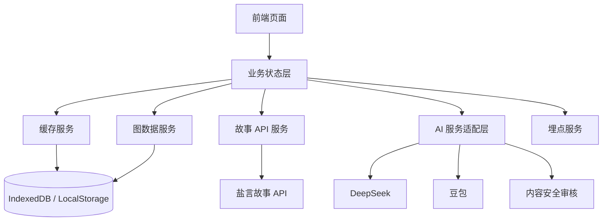
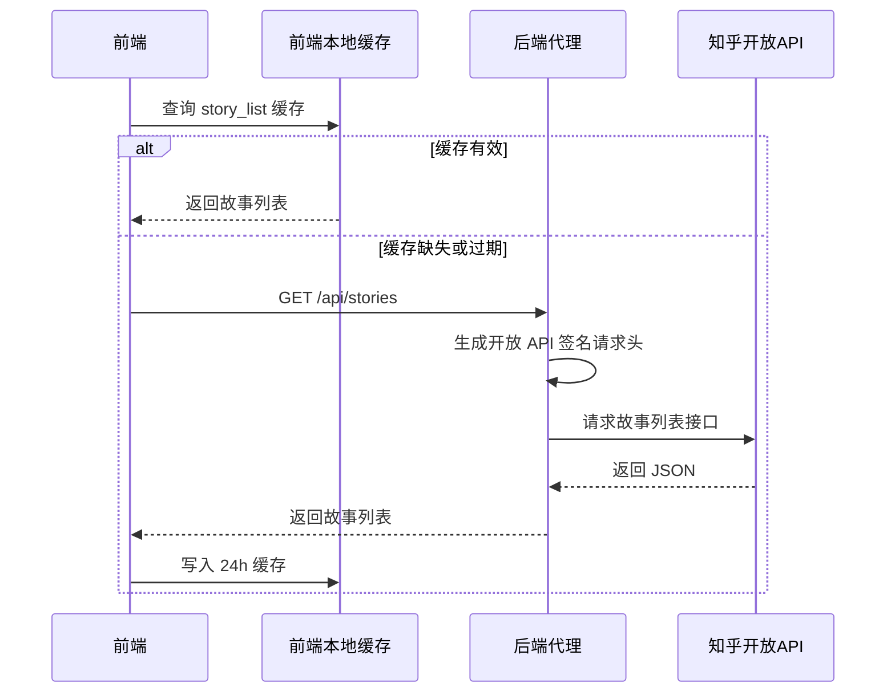
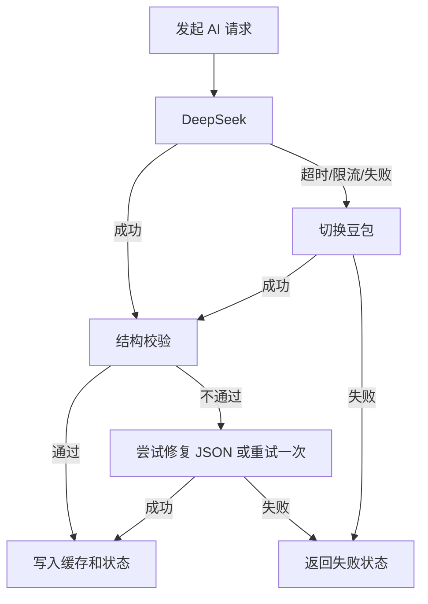
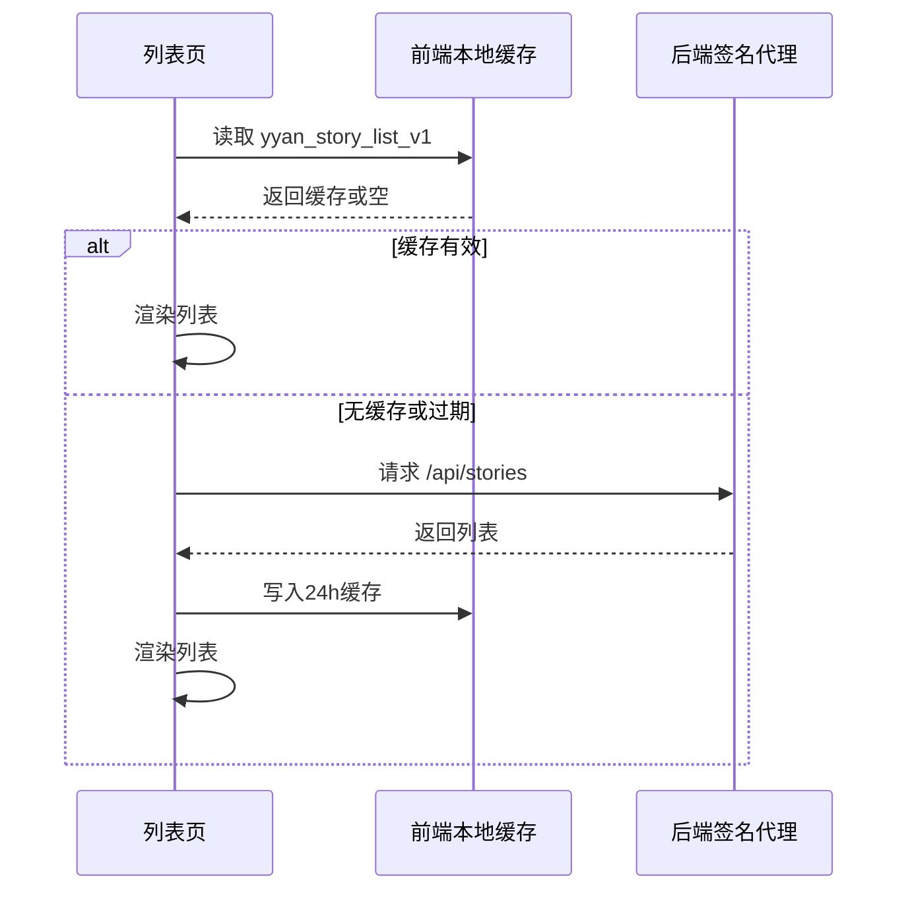
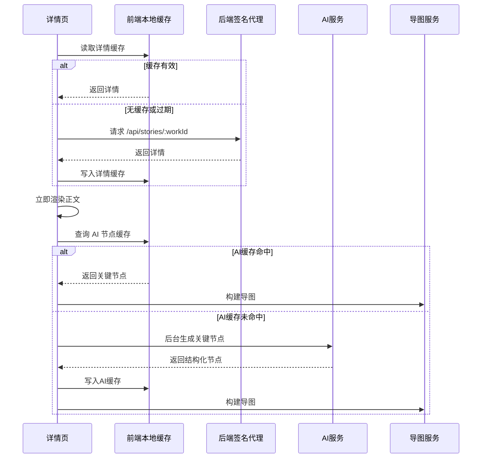
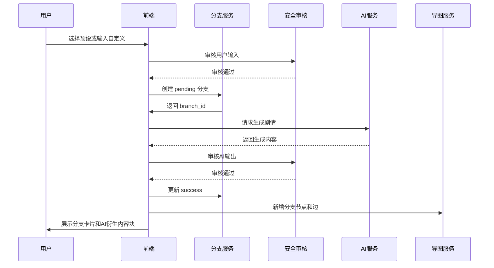
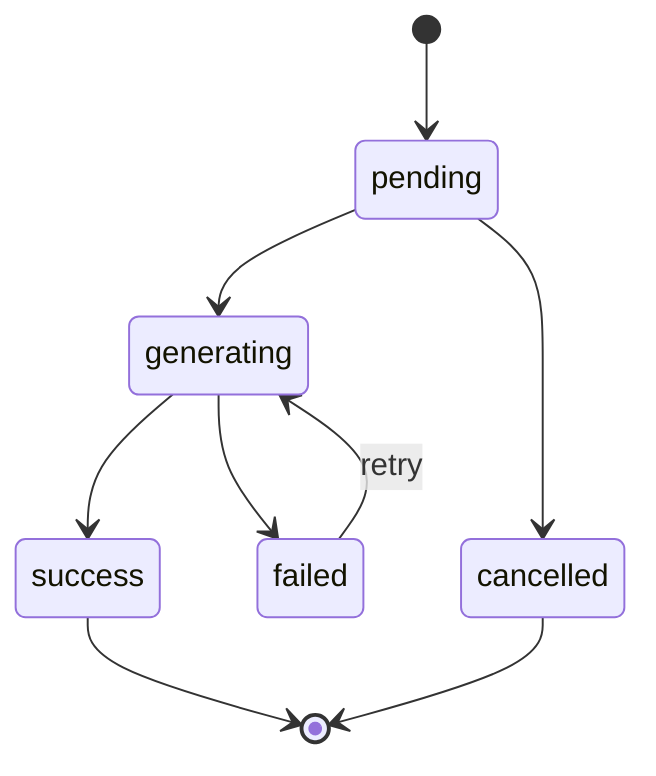

# 互动式小说技术方案 V1.0

**基于文档：**《互动式小说产品需求交互设计文档（PRD）- V1.2 优化版》  
**技术目标：** 支撑 P0 MVP：列表、详情、24h 缓存、AI 关键节点、分支生成、思维导图、番外/续写。  
**核心原则：** 阅读优先、前端本地缓存强制、AI 可降级、原文与衍生内容分离、结构化输出、后端无状态代理。

---

## 一、技术目标

P0 需要完成以下能力：

- 从盐言 API 获取故事列表和详情。
- 在前端强制本地缓存列表和详情 24 小时。
- 详情页优先展示正文，不等待 AI。
- 后台调用 AI 生成关键节点、分支选项、基础世界观摘要。
- 用户选择或输入后生成分支剧情。
- 番外/续写复用分支生成链路。
- 本地保存分支会话和思维导图节点。
- 思维导图支持小窗、全屏、点击定位。
- DeepSeek 主用，豆包备用。
- AI 输出全部使用结构化 JSON。

---

## 二、整体架构



### 2.1 知乎开放 API 鉴权与故事接口接入

知乎社区开放 API 的基础地址为：

```text
https://openapi.zhihu.com/
```

开发调试中直接访问 `www.zhihu.com/ring/moltbook/api/...` 会在未登录状态下返回 `302` 并跳转至：

```text
https://www.zhihu.com/signin?next=...
```

正式接入应优先使用知乎社区开放 API 的 AK/SK 签名鉴权方式，不应依赖浏览器个人 Cookie。

#### 鉴权参数

| 参数 | 来源 | 说明 |
|---|---|---|
| `app_key` | 用户 token | 打开知乎个人主页，复制链接，取 `people/` 后面的一串内容 |
| `app_secret` | 应用密钥 | 知乎提供的 key，必须妥善保管 |
| `timestamp` | 服务端生成 | 秒级 Unix 时间戳 |
| `log_id` | 服务端生成 | 请求唯一标识，用于追踪 |
| `extra_info` | 服务端生成 | 扩展信息，可为空字符串 |

密钥必须存放在服务端环境变量中，不允许写入前端代码、Markdown 文档或 Git 仓库。

推荐环境变量：

```text
ZHIHU_APP_KEY=your_zhihu_people_token
ZHIHU_APP_SECRET=your_zhihu_app_secret
ZHIHU_OPENAPI_BASE_URL=https://openapi.zhihu.com
```

#### 签名算法

待签名字符串：

```text
app_key:{app_key}|ts:{timestamp}|logid:{log_id}|extra_info:{extra_info}
```

签名方式：

1. 使用 `app_secret` 作为密钥。
2. 对待签名字符串做 `HMAC-SHA256`。
3. 将结果做 Base64 编码，得到 `X-Sign`。

TypeScript 示例：

```ts
import crypto from 'node:crypto';

interface ZhihuAuthHeadersInput {
  appKey: string;
  appSecret: string;
  extraInfo?: string;
}

export function createZhihuAuthHeaders(input: ZhihuAuthHeadersInput) {
  const timestamp = Math.floor(Date.now() / 1000).toString();
  const logId = `request_${Date.now()}_${Math.random().toString(36).slice(2)}`;
  const extraInfo = input.extraInfo ?? '';

  const signStr = `app_key:${input.appKey}|ts:${timestamp}|logid:${logId}|extra_info:${extraInfo}`;
  const sign = crypto
    .createHmac('sha256', input.appSecret)
    .update(signStr)
    .digest('base64');

  return {
    'X-App-Key': input.appKey,
    'X-Timestamp': timestamp,
    'X-Log-Id': logId,
    'X-Sign': sign,
    'X-Extra-Info': extraInfo,
  };
}
```

#### 请求头

所有开放 API 请求必须包含：

| 请求头 | 必填 | 说明 |
|---|---|---|
| `X-App-Key` | 是 | 应用标识，即用户 token |
| `X-Timestamp` | 是 | 当前秒级时间戳 |
| `X-Log-Id` | 是 | 请求日志 ID |
| `X-Sign` | 是 | HMAC-SHA256 + Base64 签名 |
| `X-Extra-Info` | 是 | 额外信息，可为空 |

签名失败返回：

```json
{
  "error": {
    "code": 101,
    "name": "AuthenticationError",
    "message": "Key verification failed"
  }
}
```

#### 推荐后端代理

P0 仍建议由后端统一封装开放 API，不让前端直接持有 `app_secret`：

```text
GET /api/stories
GET /api/stories/:workId
```

后端到知乎开放 API 的映射：

| 前端请求 | 后端代理 | 知乎开放 API |
|---|---|---|
| 获取故事列表 | `GET /api/stories` | `GET https://openapi.zhihu.com/openapi/hackathon_story/list` |
| 获取故事详情 | `GET /api/stories/:workId` | `GET https://openapi.zhihu.com/openapi/hackathon_story/detail?work_id={workId}` |
 
故事列表接口无需请求参数，返回顺序与内容库固定表顺序一致。

成功响应：

```json
{
  "status": 0,
  "msg": "success",
  "data": [
    {
      "work_id": "1644038836790169600",
      "title": "秦始皇登月计划",
      "artwork": "https://picx.zhimg.com/...",
      "tab_artwork": "https://picx.zhimg.com/...",
      "description": "作品简介文本",
      "labels": ["史脑洞"]
    }
  ]
}
```

故事详情接口通过 query 参数传入 `work_id`，正文内容保留段落换行，最多返回 3000 字。

成功响应：

```json
{
  "status": 0,
  "msg": "success",
  "data": {
    "work_id": "1644038836790169600",
    "chapter_name": "第一章",
    "author_avatar": "https://picx.zhimg.com/...",
    "author_name": "六酒",
    "labels": ["史脑洞"],
    "introduction": "导语文本",
    "content": "第一段正文\n第二段正文"
  }
}
```

失败响应：

```json
{
  "status": 1,
  "msg": "story not found",
  "data": null
}
```

```json
{
  "status": 1,
  "msg": "work_id is required",
  "data": null
}
```

失败响应：

```json
{
  "status": 1,
  "msg": "failed to get story list",
  "data": null
}
```

后端代理负责：

- 从环境变量读取 `app_key` 和 `app_secret`。
- 为每次请求生成 `timestamp`、`log_id`、`X-Sign`。
- 调用 `https://openapi.zhihu.com/` 下的开放接口。
- 处理 `401 AuthenticationError`。
- 统一返回前端稳定 JSON。
- 不落库、不缓存故事正文、不保存 AI 结果和用户分支。
- 屏蔽知乎接口字段或路径变化。

24 小时强制缓存由前端 `IndexedDB / LocalStorage` 执行。后端只作为无状态签名代理，避免存储用户阅读数据和 AI 衍生内容。

#### 故事接口代理流程



#### 需要补齐的接口信息

开发前需要确认开放 API 文档中的真实路径和参数：

- `401 AuthenticationError`、限流、无权限时的返回结构。

不要把 `app_secret`、个人 Cookie 或其他敏感凭证写入代码或文档。调试时应使用本地环境变量或后端安全配置。

### 2.2 前端模块

| 模块 | 责任 |
|---|---|
| `StoryListPage` | 故事列表、搜索、缓存读取 |
| `StoryDetailPage` | 正文阅读、AI 任务调度、页面布局 |
| `StoryReader` | 正文段落渲染、关键节点高亮、AI 衍生内容块 |
| `BranchSelector` | 分支选项、自定义输入 |
| `BranchPanel` | 右侧选择记录和生成状态 |
| `MindMapPanel` | 小窗和全屏思维导图 |
| `ExtraContinuationEntry` | 番外 / 续写入口 |
| `KanshanGuide` | 刘看山提示 |
| `CacheIndicator` | 数据来源和缓存时间提示 |

### 2.3 服务模块

| 服务 | 责任 |
|---|---|
| `storyApiService` | 封装知乎开放 API 的故事列表、详情接口 |
| `cacheService` | 24h 强制缓存、AI 结果缓存 |
| `storyAnalysisService` | 调度 AI 分析任务 |
| `branchService` | 分支创建、状态更新、重试、删除 |
| `mindMapService` | 图节点、边、定位关系维护 |
| `aiProvider` | DeepSeek / 豆包统一适配 |
| `safetyService` | 输入和输出安全审核 |
| `analyticsService` | 埋点上报 |

---

## 三、推荐目录结构

以下为推荐结构，具体可根据项目技术栈调整：

```text
src/
  pages/
    StoryListPage/
    StoryDetailPage/
  components/
    story/
      StoryCard/
      StoryReader/
      KeyNodeHighlight/
      AIGeneratedBlock/
    branch/
      BranchSelector/
      BranchPanel/
      BranchCard/
    mindmap/
      MindMapPanel/
      MindMapFullscreen/
      MindMapNode/
    guide/
      KanshanGuide/
    common/
      CacheIndicator/
      LoadingState/
      EmptyState/
  services/
    storyApiService.ts
    cacheService.ts
    ai/
      aiProvider.ts
      deepseekProvider.ts
      doubaoProvider.ts
      prompts.ts
      schemas.ts
    branchService.ts
    mindMapService.ts
    safetyService.ts
    analyticsService.ts
  stores/
    storyListStore.ts
    storyDetailStore.ts
    branchStore.ts
    mindMapStore.ts
  types/
    story.ts
    ai.ts
    branch.ts
    mindmap.ts
    cache.ts
  utils/
    hash.ts
    textAnchor.ts
    time.ts
```

---

## 四、数据模型

## 4.1 故事概要

```ts
export interface StorySummary {
  work_id: string;
  title: string;
  artwork: string;
  tab_artwork: string;
  description: string;
  labels: string[];
}

export interface ZhihuOpenApiResponse<T> {
  status: number;
  msg: string;
  data: T;
}

export type StoryListResponse = ZhihuOpenApiResponse<StorySummary[] | null>;
export type StoryDetailResponse = ZhihuOpenApiResponse<StoryDetail | null>;
```

## 4.2 故事详情

```ts
export interface StoryDetail {
  work_id: string;
  chapter_name: string;
  author_avatar: string;
  author_name: string;
  labels: string[];
  introduction: string;
  content: string;
  content_hash: string;
}
```

## 4.3 段落结构

```ts
export interface StoryParagraph {
  paragraph_index: number;
  text: string;
  paragraph_hash: string;
}
```

## 4.4 AI 故事分析

```ts
export interface StoryAnalysis {
  work_id: string;
  content_hash: string;
  model: string;
  prompt_version: string;
  story_summary: string;
  world_summary?: string;
  tone?: string;
  characters?: CharacterProfile[];
  relations?: CharacterRelation[];
  locations?: unknown[];
  objects?: unknown[];
}

export interface CharacterProfile {
  character_id: string;
  name: string;
  role: string;
  personality?: string;
  motivation?: string;
  speech_style?: string;
}

export interface CharacterRelation {
  from: string;
  to: string;
  relation: string;
}
```

## 4.5 关键节点

```ts
export type KeyNodeImportance = 'main' | 'secondary';
export type KeyNodeType =
  | 'turning_point'
  | 'dialogue'
  | 'emotion_peak'
  | 'reveal'
  | 'ending_choice';

export interface KeyNode {
  node_id: string;
  title: string;
  summary: string;
  importance: KeyNodeImportance;
  node_type: KeyNodeType;
  paragraph_index: number;
  char_range: [number, number];
  anchor_text: string;
  quote_hash: string;
  confidence: number;
  branch_options: BranchOption[];
}

export interface BranchOption {
  option_id: string;
  text: string;
  tone?: string;
}
```

## 4.6 分支

```ts
export type BranchType = 'node_branch' | 'extra' | 'continuation';
export type ChoiceType = 'preset' | 'custom';
export type BranchStatus = 'pending' | 'generating' | 'success' | 'failed' | 'cancelled';

export interface Branch {
  branch_id: string;
  branch_type: BranchType;
  source_node_id?: string;
  choice_type: ChoiceType;
  choice_text: string;
  status: BranchStatus;
  generated_content?: string;
  summary?: string;
  error_message?: string;
  created_at: number;
  updated_at: number;
  model?: string;
  prompt_version?: string;
}
```

## 4.7 思维导图

```ts
export type MindMapNodeType =
  | 'root'
  | 'story_node'
  | 'branch_point'
  | 'branch'
  | 'extra'
  | 'continuation'
  | 'world'
  | 'character'
  | 'object';

export interface MindMapNode {
  id: string;
  parent_id?: string;
  type: MindMapNodeType;
  label: string;
  summary?: string;
  target_paragraph_index?: number;
  source_node_id?: string;
  branch_id?: string;
  status?: BranchStatus;
}

export interface MindMapEdge {
  id: string;
  source: string;
  target: string;
  type: 'story' | 'branch' | 'extra' | 'continuation';
}

export interface MindMapGraph {
  nodes: MindMapNode[];
  edges: MindMapEdge[];
}
```

## 4.8 阅读会话

```ts
export interface ReadingSession {
  session_id: string;
  work_id: string;
  base_content_hash: string;
  active_branch_ids: string[];
  branch_history: Branch[];
  graph_data: MindMapGraph;
  created_at: number;
  updated_at: number;
}
```

---

## 五、前端本地存储与缓存方案

## 5.0 故事 API 代理实现

前端不直接请求知乎开放 API，而是请求后端代理：

```text
GET /api/stories
GET /api/stories/:workId
```

后端代理请求：

```text
GET https://openapi.zhihu.com/openapi/hackathon_story/list
GET https://openapi.zhihu.com/openapi/hackathon_story/detail?work_id={workId}
```

请求头由服务端生成：

```text
X-App-Key: ${APP_KEY}
X-Timestamp: ${TIMESTAMP}
X-Sign: ${SIGN}
X-Log-Id: ${LOG_ID}
X-Extra-Info:
```

列表接口返回 `status=0` 才视为成功。若 `status !== 0` 或 `data` 不是数组，后端应按接口失败处理并返回错误，前端不写入正常缓存。

```ts
async function fetchStoryListFromZhihu(): Promise<StorySummary[]> {
  const headers = createZhihuAuthHeaders({
    appKey: process.env.ZHIHU_APP_KEY!,
    appSecret: process.env.ZHIHU_APP_SECRET!,
  });

  const response = await fetch(
    `${process.env.ZHIHU_OPENAPI_BASE_URL}/openapi/hackathon_story/list`,
    { method: 'GET', headers }
  );

  if (!response.ok) {
    throw new Error(`Zhihu story list request failed: ${response.status}`);
  }

  const payload = (await response.json()) as StoryListResponse;

  if (payload.status !== 0 || !Array.isArray(payload.data)) {
    throw new Error(payload.msg || 'failed to get story list');
  }

  return payload.data;
}
```

详情接口同样需要服务端签名，`work_id` 必填。`work_id` 不在固定内容库中、作品资源缺失或内容服务异常时，接口可能返回 `status=1`，后端应透传可读错误给前端，由前端决定是否保留旧缓存，但不要写入新的正常详情缓存。

```ts
async function fetchStoryDetailFromZhihu(workId: string): Promise<StoryDetail> {
  if (!workId) {
    throw new Error('work_id is required');
  }

  const headers = createZhihuAuthHeaders({
    appKey: process.env.ZHIHU_APP_KEY!,
    appSecret: process.env.ZHIHU_APP_SECRET!,
  });

  const url = new URL(
    `${process.env.ZHIHU_OPENAPI_BASE_URL}/openapi/hackathon_story/detail`
  );
  url.searchParams.set('work_id', workId);

  const response = await fetch(url, { method: 'GET', headers });

  if (!response.ok) {
    throw new Error(`Zhihu story detail request failed: ${response.status}`);
  }

  const payload = (await response.json()) as StoryDetailResponse;

  if (payload.status !== 0 || !payload.data) {
    throw new Error(payload.msg || 'failed to get story detail');
  }

  return {
    ...payload.data,
    content_hash: createContentHash(payload.data.content),
  };
}
```

## 5.1 存储选择

P0 建议：

- 小型配置、缓存索引：`LocalStorage`
- 故事详情、AI 结果、分支会话：`IndexedDB`

原因：

- 故事正文和 AI 生成内容可能较长，不适合全部放 LocalStorage。
- IndexedDB 更适合结构化大文本和会话记录。

后端不使用业务数据库，不保存以下数据：

- 故事列表。
- 故事正文。
- AI 关键节点和世界观分析结果。
- 用户选择和分支内容。
- 思维导图节点和阅读会话。

## 5.2 知乎接口缓存

### 列表缓存

```ts
export interface StoryListCache {
  data: StorySummary[];
  cached_at: number;
  expires_at: number;
  source: 'remote_api';
}
```

缓存键：

```text
yyan_story_list_v1
```

### 详情缓存

```ts
export interface StoryDetailCache {
  work_id: string;
  data: StoryDetail;
  cached_at: number;
  expires_at: number;
  content_hash: string;
}
```

缓存键：

```text
yyan_story_detail_{work_id}
```

## 5.3 强制缓存读取逻辑

```ts
async function getWithStrictCache<T>(
  key: string,
  ttlMs: number,
  fetcher: () => Promise<T>,
  options?: { forceRefresh?: boolean }
): Promise<T> {
  const cached = await cacheService.get<T>(key);

  if (!options?.forceRefresh && cached && Date.now() < cached.expires_at) {
    return cached.data;
  }

  if (!options?.forceRefresh && cached && Date.now() >= cached.expires_at) {
    await cacheService.remove(key);
  }

  const data = await fetcher();
  await cacheService.set(key, {
    data,
    cached_at: Date.now(),
    expires_at: Date.now() + ttlMs,
  });
  return data;
}
```

P0 中 `forceRefresh` 仅允许调试模式或缓存损坏场景使用。

## 5.4 AI 结果缓存

AI 缓存键：

```text
ai_{task_type}_{work_id}_{content_hash}_{prompt_version}_{model}
```

示例：

```text
ai_key_nodes_1644038836790169600_sha256_xxx_v1_deepseek
```

AI 缓存命中后：

- 不重复请求模型。
- 直接更新页面状态和思维导图。
- 仍可在调试模式下清理缓存重新生成。

---

## 六、AI 服务方案

## 6.1 模型策略

| 场景 | 主模型 | 备用 |
|---|---|---|
| 故事摘要 | DeepSeek | 豆包 |
| 关键节点提炼 | DeepSeek | 豆包 |
| 分支选项生成 | DeepSeek | 豆包 |
| 分支剧情生成 | DeepSeek | 豆包 |
| 番外/续写方向 | DeepSeek | 豆包 |
| 番外/续写正文 | DeepSeek | 豆包 |
| 内容安全 | 独立审核服务 | 豆包或平台审核能力 |

## 6.2 AI Provider 接口

```ts
export interface StoryAIProvider {
  analyzeStory(input: AnalyzeStoryInput): Promise<StoryAnalysis>;
  generateKeyNodes(input: KeyNodeInput): Promise<KeyNode[]>;
  generateBranchOptions(input: BranchOptionInput): Promise<BranchOption[]>;
  generateBranchContent(input: BranchGenerateInput): Promise<BranchResult>;
  generateExtraOrContinuation(input: ExtraInput): Promise<BranchResult>;
}
```

## 6.3 降级策略



### 失败条件

- HTTP 请求失败。
- 超过超时时间。
- 模型返回非 JSON。
- JSON schema 校验失败。
- 安全审核不通过。

## 6.4 超时建议

| 任务 | 超时 |
|---|---|
| 关键节点提炼 | 15-25s |
| 分支选项生成 | 8-12s |
| 分支剧情生成 | 20-40s |
| 番外/续写方向 | 8-12s |
| 番外/续写正文 | 30-60s |

P0 前端展示上，超过 8s 可提示“AI 正在继续生成”，但不一定立即判失败。

## 6.5 Prompt 版本管理

所有 AI 请求必须携带：

- `task_type`
- `prompt_version`
- `model`
- `work_id`
- `content_hash`

这样缓存、灰度和回滚才可控。

---

## 七、关键流程实现

## 7.1 列表页



## 7.2 详情页初始化



## 7.3 分支生成



---

## 八、正文锚点方案

## 8.1 为什么不能只用段落索引

AI 关键节点如果只绑定 `paragraph_index`，当段落解析变化、空行处理变化或正文格式调整时，节点可能错位。

## 8.2 推荐锚点字段

```ts
export interface TextAnchor {
  paragraph_index: number;
  char_range: [number, number];
  anchor_text: string;
  quote_hash: string;
}
```

## 8.3 定位策略

优先级：

1. 使用 `paragraph_index + char_range` 精确定位。
2. 若失败，用 `quote_hash` 在全文中查找。
3. 若仍失败，用 `anchor_text` 模糊匹配。
4. 若仍失败，降级定位到段落。

---

## 九、思维导图实现

## 9.1 图数据来源

思维导图由以下数据生成：

- 故事根节点。
- AI 关键节点。
- 用户分支。
- 番外。
- 续写。

## 9.2 构建规则

```ts
function buildMindMapGraph(params: {
  story: StoryDetail;
  keyNodes: KeyNode[];
  branches: Branch[];
}): MindMapGraph {
  const root: MindMapNode = {
    id: `root_${params.story.work_id}`,
    type: 'root',
    label: params.story.chapter_name,
  };

  // 实际实现中按 keyNodes 和 branches 生成 nodes/edges
  return {
    nodes: [root],
    edges: [],
  };
}
```

## 9.3 P0 交互

- 点击节点：定位正文或 AI 衍生内容块。
- 全屏查看：扩大画布，不改变图结构。
- 收起：回到右上角小窗。
- 节点生成中：展示 loading 态。
- 节点失败：展示失败态和重试入口。

---

## 十、状态管理

## 10.1 页面状态

```ts
export interface StoryDetailState {
  story?: StoryDetail;
  paragraphs: StoryParagraph[];
  keyNodes: KeyNode[];
  branches: Branch[];
  graph: MindMapGraph;
  loading: {
    story: boolean;
    keyNodes: boolean;
    world: boolean;
  };
  error?: {
    story?: string;
    keyNodes?: string;
  };
}
```

## 10.2 分支状态流转



---

## 十一、安全与合规实现

## 11.1 审核点

| 审核对象 | 时机 |
|---|---|
| 用户自定义输入 | 调用 AI 前 |
| AI 生成分支内容 | 展示前 |
| 番外 / 续写方向 | 展示前 |
| 番外 / 续写正文 | 展示前 |

## 11.2 不通过处理

- 用户输入不通过：提示“这个方向暂时不能生成，换个说法试试”。
- AI 输出不通过：不展示原文，提示“这次生成结果不合适，已为你拦截”。
- 连续失败：关闭当前任务，允许用户重新输入。

## 11.3 版权标识

所有 AI 内容展示时都应标注：

```text
AI 衍生内容
```

分享或导出时也必须保留该标识。

---

## 十二、埋点方案

## 12.1 基础事件

| 事件 | 触发 |
|---|---|
| `story_list_view` | 列表页曝光 |
| `story_card_click` | 点击故事卡片 |
| `story_detail_view` | 详情页曝光 |
| `story_cache_hit` | 列表或详情缓存命中 |
| `story_cache_miss` | 缓存未命中 |

## 12.2 AI 事件

| 事件 | 触发 |
|---|---|
| `ai_key_nodes_start` | 开始生成关键节点 |
| `ai_key_nodes_success` | 关键节点生成成功 |
| `ai_key_nodes_failed` | 关键节点生成失败 |
| `branch_generate_start` | 开始生成分支 |
| `branch_generate_success` | 分支生成成功 |
| `branch_generate_failed` | 分支生成失败 |

## 12.3 互动事件

| 事件 | 触发 |
|---|---|
| `key_node_expose` | 关键节点曝光 |
| `key_node_click` | 点击关键节点 |
| `branch_option_select` | 选择预设选项 |
| `branch_custom_submit` | 提交自定义输入 |
| `mindmap_fullscreen_open` | 打开全屏导图 |
| `mindmap_node_click` | 点击导图节点 |
| `extra_click` | 点击番外 |
| `continuation_click` | 点击续写 |

---

## 十三、性能与成本控制

## 13.1 性能

- 正文渲染优先，AI 任务延后到正文可读后触发。
- 长正文按段落渲染，必要时做虚拟列表。
- 思维导图小窗只渲染核心节点，全屏时再渲染完整图。
- 分支生成不阻塞正文滚动。

## 13.2 成本

- AI 结果缓存，避免重复分析。
- 关键节点数量限制为 3-8 个。
- P0 不默认生成完整 NPC 小传和关系网。
- 番外/续写按用户点击触发，不预生成正文。
- DeepSeek 主用，豆包只做备用。

---

## 十四、验收标准

### 14.1 功能验收

- 列表页可以展示故事列表。
- 搜索可按标题和简介筛选。
- 列表和详情缓存 24 小时内命中。
- 详情页正文优先展示。
- AI 后台生成关键节点。
- 关键节点可点击并展示分支选项。
- 用户选择后可生成分支剧情。
- 分支记录卡片状态正确。
- AI 衍生内容块插入正确。
- 思维导图新增分支节点。
- 番外和续写可生成并进入导图。

### 14.2 技术验收

- AI 输出通过 JSON schema 校验。
- DeepSeek 失败后可降级豆包。
- AI 缓存命中后不重复调用模型。
- 原文和 AI 衍生内容分离存储。
- 正文锚点定位有 fallback。
- 分支状态可恢复。
- 关键错误有日志和埋点。

### 14.3 体验验收

- 进入详情页不出现阻塞式 AI Loading。
- 分支生成中用户仍可阅读。
- 刘看山不频繁打扰。
- 思维导图能完成定位和分支查看。

---

## 十五、开发里程碑

### M1：基础阅读闭环

- 列表页。
- 详情页。
- 24h 缓存。
- 正文段落渲染。

### M2：AI 节点与高亮

- AI Provider。
- 关键节点生成。
- AI 缓存。
- 正文高亮。

### M3：分支生成

- 分支选择浮层。
- 分支生成服务。
- 分支记录面板。
- AI 衍生内容块。

### M4：思维导图与番外续写

- 思维导图小窗。
- 全屏导图。
- 节点定位。
- 番外 / 续写。

### M5：异常、埋点与体验打磨

- 安全审核。
- 错误重试。
- 刘看山提示。
- 埋点。
- 性能优化。

---

## 十六、待确认技术问题

1. 前端技术栈是否已确定。
2. 是否有后端服务承接 AI 调用，还是前端直连代理接口。
3. 盐言 API 是否存在鉴权、签名或跨域限制。
4. DeepSeek 和豆包 API Key 如何管理。
5. 是否已有内容安全审核服务。
6. 是否需要支持移动端 P0。
7. 分支会话是否需要跨设备同步，还是仅本地保存。
8. 刘看山素材格式和加载方式是否已确定。
