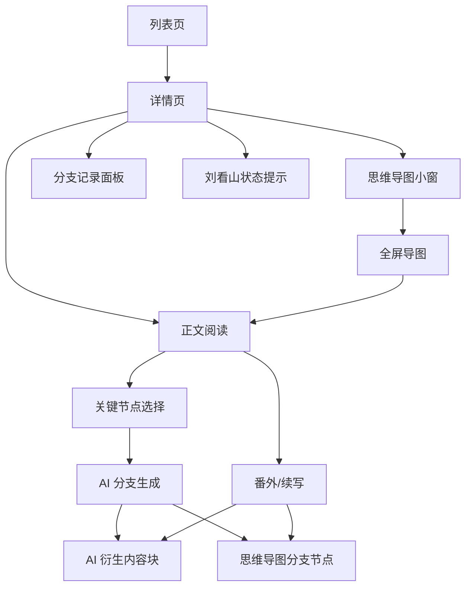
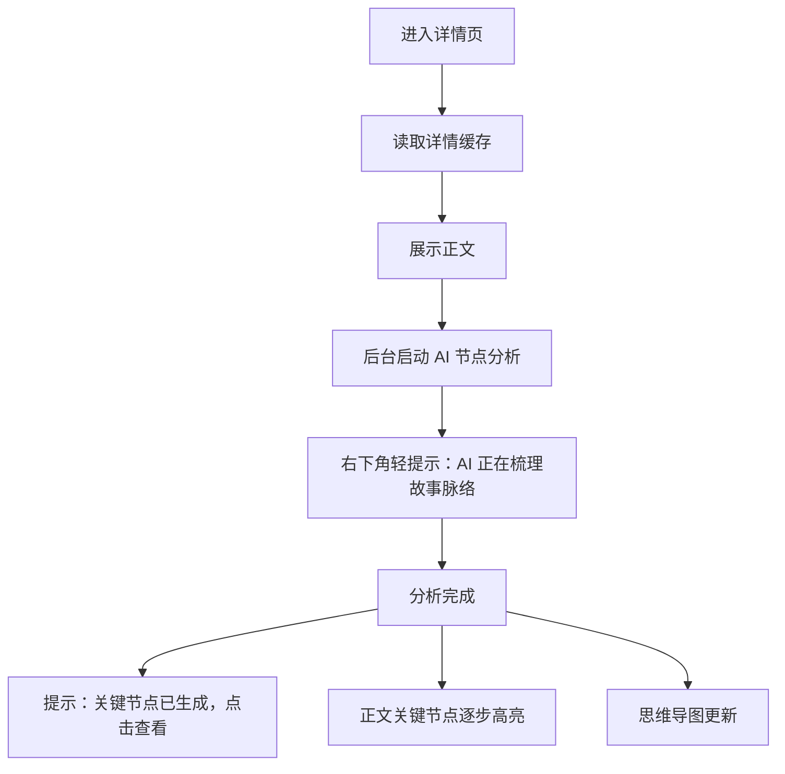

# 互动式小说设计稿说明 V1.0

**基于文档：**《互动式小说产品需求交互设计文档（PRD）- V1.2 优化版》  
**设计目标：** 用低打扰、高沉浸的方式，让用户在阅读盐言故事时完成剧情选择、查看 AI 分支，并通过思维导图快速定位故事路径。  
**适用范围：** P0 MVP 设计稿、原型、研发走查。

---

## 一、设计原则

### 1. 阅读优先

正文是页面的视觉中心。AI 分析、分支生成、思维导图和刘看山都只能作为辅助，不应抢正文注意力。

### 2. 互动克制

关键节点不宜过多。正文默认只高亮 3-8 个高置信节点，避免把小说阅读变成密集点击界面。

### 3. 原文与 AI 内容分层

原始正文保持稳定，AI 分支、番外、续写作为“AI 衍生内容块”展示，并明确标注。

### 4. 导图服务定位

思维导图用于总览、定位和查看分支，不做复杂编辑器。

### 5. 轻量陪伴

刘看山用于状态提示和情绪缓冲，避免频繁弹气泡。

---

## 二、信息架构



---

## 三、页面一：列表页

### 3.1 页面目标

让用户快速浏览盐言故事，并通过搜索找到想阅读和互动的故事。

### 3.2 页面结构

```text
┌──────────────────────────────────────────────┐
│ 顶部导航                                      │
│ Logo  知乎·盐言·互动阅读              个人入口 │
├──────────────────────────────────────────────┤
│ 搜索框                                        │
│ [ 搜索故事标题、简介 ]                         │
├──────────────────────────────────────────────┤
│ 故事卡片列表                                  │
│ ┌────────────┐  标题                          │
│ │ 封面图      │  简介两行                       │
│ │            │  标签 标签                      │
│ └────────────┘                                │
│ ┌────────────┐  标题                          │
│ │ 封面图      │  简介两行                       │
│ └────────────┘                                │
│                                              │
│                              刘看山引导气泡    │
└──────────────────────────────────────────────┘
```

### 3.3 核心组件

| 组件 | 说明 |
|---|---|
| 顶部导航 | 展示产品名和个人入口 |
| 搜索框 | 支持标题、简介模糊搜索，300ms 防抖 |
| 故事卡片 | 封面、标题、简介、标签 |
| 空状态 | 搜索无结果时展示 |
| 缓存提示 | 页底弱提示“数据来自本地缓存，上次更新 xx” |
| 刘看山 | 首次进入后轻量提示一次 |

### 3.4 状态设计

#### 首次加载

```text
展示列表骨架屏
→ 请求接口
→ 写入 24h 缓存
→ 渲染故事卡片
```

#### 缓存命中

```text
直接展示故事列表
底部弱提示：数据来自本地缓存，上次更新 11:20
```

#### 搜索无结果

```text
空状态文案：
没有找到相关故事，换个关键词试试
```

#### 接口失败

```text
若有旧缓存：展示旧缓存 + 标记离线模式
若无缓存：展示错误状态 + 重试按钮
```

---

## 四、页面二：详情页

### 4.1 页面目标

在不打断阅读的前提下，支持用户完成剧情选择、生成 AI 分支、查看思维导图和触发番外/续写。

### 4.2 桌面端布局

```text
┌────────────────────────────────────────────────────────────────────┐
│ 顶部栏：返回  故事标题  作者  标签             本地缓存  上次更新 xx │
├─────────────────────────────────────────────┬──────────────────────┤
│                                             │ 思维导图小窗          │
│ 正文阅读区                                   │ ┌──────────────────┐ │
│                                             │ │ 根节点            │ │
│ 导语                                         │ │ ├ 关键节点 1      │ │
│                                             │ │ └ 关键节点 2      │ │
│ 正文段落 1                                   │ └──────────────────┘ │
│ 正文段落 2                                   │ [全屏查看]           │
│ 正文段落 3  关键节点高亮 [分支 icon]           ├──────────────────────┤
│                                             │ 分支记录面板          │
│ AI 衍生内容块                                │ ┌──────────────────┐ │
│                                             │ │ 你的选择：...     │ │
│ 正文末尾                                     │ │ AI 生成中...      │ │
│ [番外] [续写]                                │ └──────────────────┘ │
│                                             │ 刘看山状态提示        │
└─────────────────────────────────────────────┴──────────────────────┘
```

### 4.3 移动端布局建议

P0 如需支持移动端，建议改为单栏：

```text
顶部栏
正文阅读区
悬浮按钮：导图 / 分支记录
底部操作：番外 / 续写
刘看山轻提示
```

移动端不建议固定右侧面板，思维导图和分支记录用底部抽屉展示。

---

## 五、详情页关键交互

## 5.1 进入详情页

### 默认流程



### 设计要求

- 正文必须先于 AI 分析展示。
- AI 分析提示不阻塞阅读。
- 高亮出现不要闪烁，可以平滑淡入。
- 用户关闭提示后，本次会话不再重复弹出同类提示。

---

## 5.2 关键节点高亮

### 视觉样式

建议使用三层元素：

- 文字底色：浅色高亮，不能影响阅读。
- 分支 icon：位于高亮末尾或段落右侧。
- hover / 点击态：显示“可选择剧情”提示。

### 示例

```text
她终于意识到，所有线索都指向同一个人。  ◇
```

点击后打开分支选择浮层。

### 限制

- 每篇故事默认展示 3-8 个高置信节点。
- 同一屏内不要出现过多高亮。
- 次级节点只进入导图，不默认高亮正文。

---

## 5.3 分支选择浮层

### 触发

用户点击正文中的关键节点或分支 icon。

### 浮层结构

```text
┌────────────────────────────────────┐
│ 你想让剧情怎么发展？                 │
│                                    │
│ ○ 立刻质问对方                      │
│ ○ 假装不知道，继续调查                │
│ ○ 向朋友求助                        │
│                                    │
│ 自定义选择                           │
│ [ 输入你的想法...                 ] │
│                                    │
│ [取消]                      [生成] │
└────────────────────────────────────┘
```

### 交互规则

- 用户选择预设后，“生成”按钮可用。
- 用户输入自定义内容后，“生成”按钮可用。
- 预设和自定义二选一。
- 提交后关闭浮层，并在右侧分支记录面板新增卡片。

---

## 5.4 分支记录卡片

### 生成中

```text
┌────────────────────────────────────┐
│ 你的选择：假装不知道，继续调查         │
│                                    │
│ AI 正在生成新的剧情走向...            │
│ [ Loading ]                        │
└────────────────────────────────────┘
```

### 生成成功

```text
┌────────────────────────────────────┐
│ 你的选择：假装不知道，继续调查         │
│                                    │
│ 她压下心里的震惊，装作若无其事地...    │
│                                    │
│ 13:42  [定位] [重新生成] [删除]       │
└────────────────────────────────────┘
```

### 生成失败

```text
┌────────────────────────────────────┐
│ 你的选择：假装不知道，继续调查         │
│                                    │
│ 分支内容生成失败，换一种方式试试？      │
│                                    │
│ [重新生成] [修改输入] [删除]           │
└────────────────────────────────────┘
```

### 规则

- 最新记录展示在最上方。
- 默认最多展示 30 条。
- 支持折叠长文本。
- AI 生成中不阻塞正文阅读。

---

## 5.5 AI 衍生内容块

### 插入规则

- 正文关键节点生成的分支，展示在对应段落下方。
- 番外和续写展示在正文末尾的“AI 衍生内容区”。
- 原始正文不被改写。

### 样式

```text
┌────────────────────────────────────┐
│ AI 衍生剧情                          │
│ 来源：你的选择「假装不知道，继续调查」  │
│                                    │
│ 她压下心里的震惊，装作若无其事地...    │
└────────────────────────────────────┘
```

### 操作

- 收起 / 展开。
- 定位到思维导图节点。
- 删除当前衍生内容。
- 重新生成。

---

## 六、思维导图设计

### 6.1 小窗状态

```text
┌──────────────────────────┐
│ 思维导图           全屏   │
│                          │
│      故事标题             │
│        │                 │
│   关键节点 1              │
│     ├ 分支 A              │
│     └ 分支 B              │
│   关键节点 2              │
└──────────────────────────┘
```

### 6.2 全屏状态

```text
┌────────────────────────────────────────────────────┐
│ 思维导图                          [收起到右上角]    │
├────────────────────────────────────────────────────┤
│                                                    │
│                    故事根节点                       │
│                       │                            │
│       ┌───────────────┴───────────────┐            │
│    关键节点 1                      关键节点 2       │
│       │                               │            │
│   用户分支 A                      番外节点          │
│       │                                            │
│   续写节点                                          │
│                                                    │
└────────────────────────────────────────────────────┘
```

### 6.3 节点点击

点击节点后：

- 若节点对应原文段落：收起导图，正文滚动到对应段落。
- 若节点对应 AI 分支：收起导图，正文滚动到 AI 衍生内容块。
- 若节点内容未生成完成：展示生成中状态。

### 6.4 节点类型

| 节点 | 视觉建议 |
|---|---|
| 根节点 | 品牌色描边，展示故事标题 |
| 原文关键节点 | 蓝色或中性色节点 |
| 可分支节点 | 带分支 icon |
| 用户分支 | 紫色系 |
| 番外 / 续写 | 橙色系，标注 AI 衍生 |
| 生成中节点 | 骨架或 loading 点 |
| 失败节点 | 弱红色提示，可重试 |

---

## 七、番外 / 续写设计

### 7.1 正文末尾入口

```text
你已读到当前故事结尾

[ 生成番外 ]    [ 继续续写 ]
```

### 7.2 方向选择

```text
┌────────────────────────────────────┐
│ 想看哪种方向？                       │
│                                    │
│ ○ 讲讲两人重逢后的番外                │
│ ○ 回到故事开端，补全隐藏视角           │
│ ○ 新角色介入，带来新的冲突             │
│                                    │
│ 自定义方向                           │
│ [ 输入你想看的内容...              ] │
│                                    │
│ [取消]                      [生成] │
└────────────────────────────────────┘
```

### 7.3 生成结果

番外 / 续写生成后：

- 展示在正文末尾 AI 衍生内容区。
- 思维导图新增对应节点。
- 右侧分支记录面板新增记录。

---

## 八、刘看山引导

### 8.1 出现时机

| 场景 | 触发 | 文案示例 |
|---|---|---|
| 列表页首次进入 | 5-10 秒后 | 选一本故事，开始你的分支剧情 |
| AI 节点分析中 | 详情页正文展示后 | 我正在悄悄梳理故事脉络 |
| 节点生成完成 | AI 分析成功 | 关键节点已生成，点击导图看看 |
| 分支生成中 | 用户提交选择后 | 新剧情正在生成中 |
| 分支失败 | AI 失败 | 这次没生成好，要不要换个选择 |
| 高频互动 | 连续生成多次 | 休息一下再继续探索也不错 |

### 8.2 展示限制

- 不使用遮罩。
- 不阻塞用户操作。
- 同类提示本次会话最多展示一次。
- 用户手动关闭后不再重复展示。

---

## 九、关键状态清单

| 模块 | 状态 |
|---|---|
| 列表 | 加载中、缓存命中、搜索无结果、接口失败、离线模式 |
| 详情正文 | 加载中、展示成功、接口失败、有旧缓存 |
| AI 分析 | 未开始、分析中、成功、失败、缓存命中 |
| 关键节点 | 未生成、生成中、已生成、无节点 |
| 分支 | pending、generating、success、failed、cancelled |
| 思维导图 | 骨架、已生成、全屏、节点生成中、节点失败 |
| 番外/续写 | 方向生成中、待选择、正文生成中、成功、失败 |

---

## 十、设计交付清单

建议设计稿至少包含：

1. 列表页默认态。
2. 列表页搜索态。
3. 列表页空状态。
4. 详情页正文默认态。
5. 详情页 AI 分析中。
6. 详情页节点生成完成。
7. 分支选择浮层。
8. 分支生成中卡片。
9. 分支生成成功卡片。
10. 分支生成失败卡片。
11. AI 衍生内容块。
12. 思维导图小窗。
13. 思维导图全屏。
14. 番外/续写方向选择。
15. 番外/续写生成成功。
16. 刘看山提示样式。
17. 缓存来源提示。
18. 移动端适配方案，若 P0 需要支持。

---

## 十一、验收标准

- 正文在视觉上是页面主角。
- AI 提示不遮挡正文，不阻塞阅读。
- 关键节点高亮清晰但不刺眼。
- 用户能明确知道哪里可以选择剧情。
- 分支生成状态清晰可见。
- AI 生成内容和原文有明确区分。
- 思维导图能看出原文节点和用户分支关系。
- 番外和续写入口在正文末尾清晰可见。
- 刘看山有陪伴感，但不频繁打扰。
